<!-- GENERATED by scripts/generate-docs.php — DO NOT EDIT.
     Refreshed automatically on every commit (see .githooks/pre-commit). -->

# Generated: Validator Rules Taxonomy

Every conformance rule in `packages/core/src/Validator/Rules`, grouped by the
document area it governs (derived from rule-name prefixes). Regenerated before
every commit.

```mermaid
flowchart TD
    ROOT["Validator rules (49)"]
    G_Actions["Actions — 4"]
    ROOT --> G_Actions
    R_ActionGotoTargetResolvesRule["ActionGotoTargetResolves"]
    G_Actions --> R_ActionGotoTargetResolvesRule
    R_ActionRetryLimitsRule["ActionRetryLimits"]
    G_Actions --> R_ActionRetryLimitsRule
    R_ActionReusableRefResolvesRule["ActionReusableRefResolves"]
    G_Actions --> R_ActionReusableRefResolvesRule
    R_ActionTypeValidRule["ActionTypeValid"]
    G_Actions --> R_ActionTypeValidRule
    G_AsyncAPI["AsyncAPI — 1"]
    ROOT --> G_AsyncAPI
    R_AsyncApiFieldsRequire11Rule["AsyncApiFieldsRequire11"]
    G_AsyncAPI --> R_AsyncApiFieldsRequire11Rule
    G_Components["Components — 1"]
    ROOT --> G_Components
    R_ComponentsUniqueNamesRule["ComponentsUniqueNames"]
    G_Components --> R_ComponentsUniqueNamesRule
    G_Document_level["Document-level — 4"]
    ROOT --> G_Document_level
    R_DocUnknownFieldRule["DocUnknownField"]
    G_Document_level --> R_DocUnknownFieldRule
    R_DocumentArazzoVersionRule["DocumentArazzoVersion"]
    G_Document_level --> R_DocumentArazzoVersionRule
    R_DocumentInfoRequiredRule["DocumentInfoRequired"]
    G_Document_level --> R_DocumentInfoRequiredRule
    R_DocumentSourceDescriptionsPresentRule["DocumentSourceDescriptionsPresent"]
    G_Document_level --> R_DocumentSourceDescriptionsPresentRule
    G_Expressions["Expressions — 8"]
    ROOT --> G_Expressions
    R_ExpressionContextMisuseRule["ExpressionContextMisuse"]
    G_Expressions --> R_ExpressionContextMisuseRule
    R_ExpressionJsonPointerSyntaxRule["ExpressionJsonPointerSyntax"]
    G_Expressions --> R_ExpressionJsonPointerSyntaxRule
    R_ExpressionSyntaxRule["ExpressionSyntax"]
    G_Expressions --> R_ExpressionSyntaxRule
    R_ExpressionUnresolvedComponentRefRule["ExpressionUnresolvedComponentRef"]
    G_Expressions --> R_ExpressionUnresolvedComponentRefRule
    R_ExpressionUnresolvedInputRefRule["ExpressionUnresolvedInputRef"]
    G_Expressions --> R_ExpressionUnresolvedInputRefRule
    R_ExpressionUnresolvedSourceRefRule["ExpressionUnresolvedSourceRef"]
    G_Expressions --> R_ExpressionUnresolvedSourceRefRule
    R_ExpressionUnresolvedStepRefRule["ExpressionUnresolvedStepRef"]
    G_Expressions --> R_ExpressionUnresolvedStepRefRule
    R_ExpressionUnresolvedWorkflowRefRule["ExpressionUnresolvedWorkflowRef"]
    G_Expressions --> R_ExpressionUnresolvedWorkflowRefRule
    G_General["General — 2"]
    ROOT --> G_General
    R_SubWorkflowInvokeTargetResolvesRule["SubWorkflowInvokeTargetResolves"]
    G_General --> R_SubWorkflowInvokeTargetResolvesRule
    R_SuccessCriteriaVersionSupportedRule["SuccessCriteriaVersionSupported"]
    G_General --> R_SuccessCriteriaVersionSupportedRule
    G_Parameters["Parameters — 1"]
    ROOT --> G_Parameters
    R_ParameterQuerystringOperationShapeRule["ParameterQuerystringOperationShape"]
    G_Parameters --> R_ParameterQuerystringOperationShapeRule
    G_Selectors["Selectors — 1"]
    ROOT --> G_Selectors
    R_SelectorTypeSupportedRule["SelectorTypeSupported"]
    G_Selectors --> R_SelectorTypeSupportedRule
    G_Sources["Sources — 4"]
    ROOT --> G_Sources
    R_SelfUriSyntaxRule["SelfUriSyntax"]
    G_Sources --> R_SelfUriSyntaxRule
    R_SourceTypeMatchesRule["SourceTypeMatches"]
    G_Sources --> R_SourceTypeMatchesRule
    R_SourceUniqueNameRule["SourceUniqueName"]
    G_Sources --> R_SourceUniqueNameRule
    R_SourceUrlSyntaxRule["SourceUrlSyntax"]
    G_Sources --> R_SourceUrlSyntaxRule
    G_Specification_extensions["Specification extensions — 1"]
    ROOT --> G_Specification_extensions
    R_ExtensionsXPrefixRule["ExtensionsXPrefix"]
    G_Specification_extensions --> R_ExtensionsXPrefixRule
    G_Step_level["Step-level — 16"]
    ROOT --> G_Step_level
    R_StepAtLeastOneRule["StepAtLeastOne"]
    G_Step_level --> R_StepAtLeastOneRule
    R_StepCriteriaTypeContextRule["StepCriteriaTypeContext"]
    G_Step_level --> R_StepCriteriaTypeContextRule
    R_StepDependsOnNoCycleRule["StepDependsOnNoCycle"]
    G_Step_level --> R_StepDependsOnNoCycleRule
    R_StepIdPatternRule["StepIdPattern"]
    G_Step_level --> R_StepIdPatternRule
    R_StepNestedWorkflowExistsRule["StepNestedWorkflowExists"]
    G_Step_level --> R_StepNestedWorkflowExistsRule
    R_StepNestedWorkflowNoCycleRule["StepNestedWorkflowNoCycle"]
    G_Step_level --> R_StepNestedWorkflowNoCycleRule
    R_StepOperationIdSourceScopedRule["StepOperationIdSourceScoped"]
    G_Step_level --> R_StepOperationIdSourceScopedRule
    R_StepOperationPathSyntaxRule["StepOperationPathSyntax"]
    G_Step_level --> R_StepOperationPathSyntaxRule
    R_StepOperationTargetPresentRule["StepOperationTargetPresent"]
    G_Step_level --> R_StepOperationTargetPresentRule
    R_StepOutputsUniqueRule["StepOutputsUnique"]
    G_Step_level --> R_StepOutputsUniqueRule
    R_StepParameterInValidRule["StepParameterInValid"]
    G_Step_level --> R_StepParameterInValidRule
    R_StepParametersHaveNameRule["StepParametersHaveName"]
    G_Step_level --> R_StepParametersHaveNameRule
    R_StepRequestBodyReplacementsTargetRule["StepRequestBodyReplacementsTarget"]
    G_Step_level --> R_StepRequestBodyReplacementsTargetRule
    R_StepSuccessCriteriaConditionRule["StepSuccessCriteriaCondition"]
    G_Step_level --> R_StepSuccessCriteriaConditionRule
    R_StepTimeoutRequires11Rule["StepTimeoutRequires11"]
    G_Step_level --> R_StepTimeoutRequires11Rule
    R_StepUniqueIdRule["StepUniqueId"]
    G_Step_level --> R_StepUniqueIdRule
    G_Workflow_level["Workflow-level — 6"]
    ROOT --> G_Workflow_level
    R_WorkflowAtLeastOneRule["WorkflowAtLeastOne"]
    G_Workflow_level --> R_WorkflowAtLeastOneRule
    R_WorkflowDependsOnExistsRule["WorkflowDependsOnExists"]
    G_Workflow_level --> R_WorkflowDependsOnExistsRule
    R_WorkflowDependsOnNoCycleRule["WorkflowDependsOnNoCycle"]
    G_Workflow_level --> R_WorkflowDependsOnNoCycleRule
    R_WorkflowIdPatternRule["WorkflowIdPattern"]
    G_Workflow_level --> R_WorkflowIdPatternRule
    R_WorkflowInputsValidSchemaRule["WorkflowInputsValidSchema"]
    G_Workflow_level --> R_WorkflowInputsValidSchemaRule
    R_WorkflowUniqueIdRule["WorkflowUniqueId"]
    G_Workflow_level --> R_WorkflowUniqueIdRule
```

| Group | Rules |
|---|---|
| **Actions** | `ActionGotoTargetResolvesRule`, `ActionRetryLimitsRule`, `ActionReusableRefResolvesRule`, `ActionTypeValidRule` |
| **AsyncAPI** | `AsyncApiFieldsRequire11Rule` |
| **Components** | `ComponentsUniqueNamesRule` |
| **Document-level** | `DocUnknownFieldRule`, `DocumentArazzoVersionRule`, `DocumentInfoRequiredRule`, `DocumentSourceDescriptionsPresentRule` |
| **Expressions** | `ExpressionContextMisuseRule`, `ExpressionJsonPointerSyntaxRule`, `ExpressionSyntaxRule`, `ExpressionUnresolvedComponentRefRule`, `ExpressionUnresolvedInputRefRule`, `ExpressionUnresolvedSourceRefRule`, `ExpressionUnresolvedStepRefRule`, `ExpressionUnresolvedWorkflowRefRule` |
| **General** | `SubWorkflowInvokeTargetResolvesRule`, `SuccessCriteriaVersionSupportedRule` |
| **Parameters** | `ParameterQuerystringOperationShapeRule` |
| **Selectors** | `SelectorTypeSupportedRule` |
| **Sources** | `SelfUriSyntaxRule`, `SourceTypeMatchesRule`, `SourceUniqueNameRule`, `SourceUrlSyntaxRule` |
| **Specification extensions** | `ExtensionsXPrefixRule` |
| **Step-level** | `StepAtLeastOneRule`, `StepCriteriaTypeContextRule`, `StepDependsOnNoCycleRule`, `StepIdPatternRule`, `StepNestedWorkflowExistsRule`, `StepNestedWorkflowNoCycleRule`, `StepOperationIdSourceScopedRule`, `StepOperationPathSyntaxRule`, `StepOperationTargetPresentRule`, `StepOutputsUniqueRule`, `StepParameterInValidRule`, `StepParametersHaveNameRule`, `StepRequestBodyReplacementsTargetRule`, `StepSuccessCriteriaConditionRule`, `StepTimeoutRequires11Rule`, `StepUniqueIdRule` |
| **Workflow-level** | `WorkflowAtLeastOneRule`, `WorkflowDependsOnExistsRule`, `WorkflowDependsOnNoCycleRule`, `WorkflowIdPatternRule`, `WorkflowInputsValidSchemaRule`, `WorkflowUniqueIdRule` |
