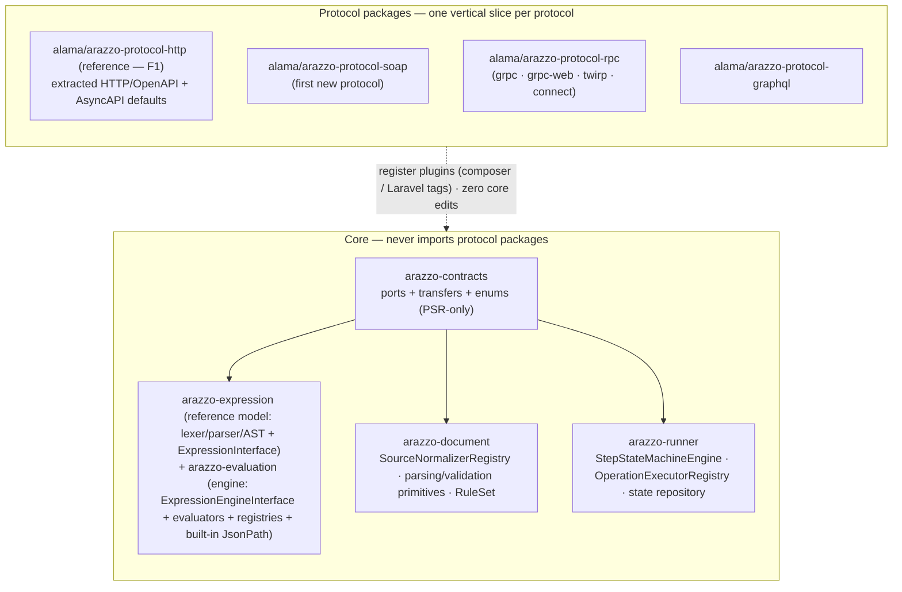
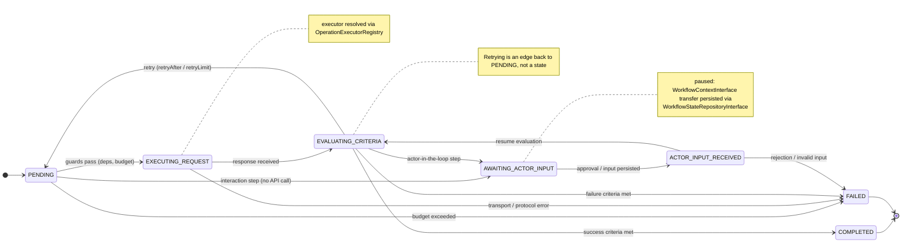
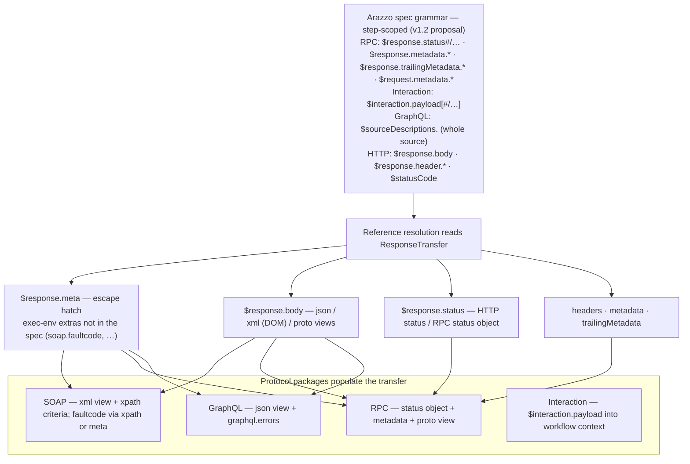

# Design — Plugin Stack, OMS Pause/Resume, Multi-Protocol Steps

Date: 2026-09-08
Issue: to be created — the Phase tickets A–H below are the issue breakdown

## Context

The Arazzo 1.1+ roadmap adds new Step targets and protocols — SOAP, gRPC,
GraphQL, MCP/A2A, and actor-in-the-loop (human or agent approval). Today, this
monorepo executes steps over HTTP/OpenAPI (plus an AsyncAPI `send`/`receive`
path) through a small protocol-executor layer, and pause/resume exists as a
scattered async-only suspension story (`SuspensionHandler`,
`CorrelationResumer`, `PendingCorrelationRegistryInterface`). The public-face
boundary work (#58–#63) is landed, so this design is **additive** on top of the
published `alama/*` package contracts — it renames nothing, re-homes only
`@internal` types, and keeps the engine hot path zero-vendor — **except** one
deliberate, user-ratified breaking major: the `Step` model is decomposed into
smaller value objects behind a factory (see "Step model decomposition"), the
only breaking change in this design.

Three forces shape this design:

1. **Zero-overhead core** — `arazzo-contracts` and the `arazzo-runner` engine
   hot path must stay vendor-free (PSR interfaces only). Vendored codecs live
   in protocol packages behind the SPI.
2. **One public face per package** (#63) — new SPI is added to `contracts`;
   existing public faces and value types stay public. New faces are deliberate,
   reviewed additions to `docs/generated/public-api.md`.
3. **Spec vocabulary** — Arazzo calls the Step target an *Operation*; the
   emerging 1.2 binding work (OAI/Arazzo-Specification#523) names the protocol
   profile a *Binding*. We adopt these words and the repo's established word
   *Executor* (see `docs/generated/ubiquitous-language-audit.md`).
4. **Protocols are vertical slices** — a protocol touches the source
   normalizer, the operation executor, the response mapping, replacement
   targets and schema validation. Corralling all of that for one protocol in
   one package is the only way to add a protocol **without editing core**.
   Core is never touched by a new protocol; it only ever consumes ports.

## Vocabulary (locked)

- **Operation** — the Arazzo domain noun a Step targets (`operationId`,
  `operationPath`, `workflowId`; per-protocol equivalents: `operationName`
  (WSDL), `rpcMethod` + `rpcProtocol` (protobuf), `graphqlOperation` (GraphQL),
  `interaction` (actor-in-the-loop)).
- **Executor** — the runtime unit that runs an Operation for a given protocol.
- **Binding** — the protocol profile that parameterizes how an Operation
  executes. A *derived* value in our model: `sourceType` (from the Source
  Description Object, e.g. `wsdl`/`protobuf`/`graphql`) + `rpcProtocol`
  (execution variant, e.g. `grpc`/`twirp`).
- **Plugin** — a named, priority-ordered extension unit behind a contracts SPI.
- **Protocol package** — a single `alama/arazzo-protocol-*` package that carries
  *all* ports a protocol implements (normalizer + executor + transfer mapper +
  replacement resolver + validator). Core never imports protocol packages.
  `arazzo-protocol-http` is extracted first (F1); SOAP/RPC/GraphQL follow it.
- **Expression package** — `alama/arazzo-expression`: the closed,
  protocol-agnostic **reference model**: lexer/parser/AST + `ReferenceKind` +
  `ExpressionReference` + `ExpressionSyntaxException` + the static
  `SymbolTable`/`WorkflowSymbols`/`StepSymbols`, exposed through the parse-side
  seam `ExpressionInterface` (`parseExpression`, `expressionReferences`,
  `buildSymbolTable`), zero-vendor (the expression model).
- **Evaluation package** — `alama/arazzo-evaluation`: the engine — the
  `ExpressionEngine`/`ExpressionEngineInterface` surface (evaluate, criteria,
  selectors, interpolation, payload replacement, JSONPath/pointer/XPath),
  evaluators, resolvers, `EvaluationInput`, and built-in JsonPath plugins.
  Every parse/inspect/symbol call uses the `ExpressionInterface` seam from
  `arazzo-expression`. Evaluation classes use the flat
  `Alama\Arazzo\Evaluation\` namespace; parse-side classes retain
  `Alama\Arazzo\Expression\`.
- **Source type** — the Arazzo 1.2 `sourceDescription.type` enum value
  (`arazzo`, `openapi`, `asyncapi`, `wsdl`, `protobuf`, `graphql`).
- **rpcProtocol** — the PR #556 execution-variant discriminator
  (`grpc`, `grpc-web`, `twirp`, `connect`); the routing key inside the RPC
  protocol package.
- **Transfer bag** — the generic protocol-specific reference surface on
  `ResponseTransfer` (`meta`), the escape hatch for execution-environment
  extras the spec does not define.

SPI seam: `OperationExecutorPluginInterface` in `contracts`; the existing
`StepProtocolExecutorInterface` remains as a `@deprecated` alias.

## Goals

- Steps can target Operations over SOAP, RPC (gRPC et al.) and GraphQL in
  addition to HTTP/OpenAPI and AsyncAPI, selected by protocol-agnostic
  registries. `arazzo-protocol-http` — the extracted HTTP/OpenAPI + AsyncAPI
  defaults — lands first as the reference slice.
- **Adding a protocol = a new `arazzo-protocol-<X>` package, zero changes to
  `arazzo-contracts`, `arazzo-evaluation`, `arazzo-expression`, `arazzo-runner` or
  `arazzo-document`.** Core only owns ports, registries, the engine, and the
  recipe the HTTP slice (F1) demonstrates.
- `arazzo-contracts`, `arazzo-expression` and the `arazzo-runner`
  engine hot path stay vendor-free.
- **Expression splits into model + evaluation** (`arazzo-expression` keeps the
  lexer/parser/AST + reference model side, `arazzo-evaluation` the engine with
  a flat evaluation namespace and built-in JsonPath plugins),
  so the lexer/parser/AST —
  the piece the spec touches — is small, zero-vendor, and reusable without the
  evaluator.
- Step execution is an explicit OMS state machine — `PENDING → EXECUTING_REQUEST
  → EVALUATING_CRITERIA → (AWAITING_ACTOR_INPUT → ACTOR_INPUT_RECEIVED) …
  → COMPLETED / FAILED` — with the `WorkflowContextInterface` transfer serialized
  by a `WorkflowStateRepositoryInterface` for safe pause/resume.
- The sync (`WorkflowExecutor`) and async (`StepExecutionWorker` /
  `StepOutcomeHandler`) loop carriers are consolidated onto one state machine,
  killing the sync/async divergence tracked in the roadmap (C11).
- Laravel auto-registers protocol packages via container tagging and a
  `PluginRegistry`.
- An arch test mechanically enforces the invariant: core imports zero
  `arazzo-protocol-*` types.

## Non-goals

- No composer-package renames (`arazzo-runner`/`arazzo-expression` keep their
  published names; the evaluation side of the split ships as a new
  `arazzo-evaluation` package).
- No changes to unrelated public faces' signatures (`RunnerFacadeInterface`,
  `DocumentInterface`). The expression split intentionally changes moved
  evaluation FQCNs once; `ExpressionInterface` is the parse-side seam and
  `ExpressionEngineInterface` remains the evaluation-side engine contract.
- No MCP/A2A Step targets in this iteration (they are just another protocol
  package later).
- No OTEL `grpc-trace-bin` propagation in this iteration (lives in the RPC
  protocol package when it lands).
- No changes to `arazzo-document`'s parsing deps (document is the parsing
  layer for its embedded OpenAPI/AsyncAPI defaults).

## Decisions (locked with stakeholders)

| # | Decision |
|---|---|
| D1 | Map roles onto existing packages; no composer renames. New SPI via new interfaces. |
| D2 | `WorkflowStateRepositoryInterface` persists the serialized `WorkflowContextInterface` transfer plus a versioned envelope with the current `StepState`. |
| D3 | Zero-vendor core = `contracts` + `arazzo-expression` + `runner` engine hot path. Document/CLI keep parsing deps. |
| D4 | `arazzo-protocol-http` is the **first** protocol slice (Phase F1): the extracted HTTP/OpenAPI + AsyncAPI defaults prove the vertical pattern. SOAP (F2, zero-vendor DOM + PSR-18) is the first **new**-protocol slice. |
| D5 | Protocol Buffer RPC is planned fully: one `arazzo-protocol-rpc` package carries the `.proto` normalizer + executor for all four `rpcProtocol` variants (grpc, grpc-web, twirp, connect); optional `grpc/grpc` + `google/protobuf` vendor allowed only there. |
| D6 | Protocol-typed response handling is **additive**: new `ResponseTransferInterface` seam (in contracts) + per-protocol transfer DTOs implementing it (in protocol packages); existing `EvaluationInput` DTO untouched. |
| D7 | **Protocols are vertical packages.** Every seam a protocol touches (source normalizer, executor, transfer mapper, replacement resolver, schema validator) ships in `alama/arazzo-protocol-<X>`. Core edits nothing when a protocol is added. |
| D8 | **Spec-mandated, step-scoped grammar.** The lexer gains only the expression forms the Arazzo spec itself defines, each scoped to its step type (`$response.status#/…`, `$response.metadata.*`, `$response.trailingMetadata.*` on RPC steps; `$interaction.payload` on interaction steps; `$sourceDescriptions.<name>` whole-source for GraphQL) plus ONE generic `$response.meta.<key>` escape hatch for execution-environment extras. A protocol never invents grammar the spec does not define; extra keys go in the `meta` bag. |
| D9 | **HTTP-first extraction.** `arazzo-protocol-http` (F1) relocates the embedded OpenAPI/AsyncAPI normalizers + HTTP/AsyncAPI executors + `RequestCompiler` + response validators out of `document`/`runner` into the first vertical slice — Guzzle/`cebe`/jsonpath deps move with it. The umbrella (`arazzo-core`, laravel, cli) requires it by default so end-user composition is unchanged; standalone `document`/`runner` consumers resolve OpenAPI through the registry once the package is registered (documented change). |
| D10 | **Design to PR shapes now.** The four open `v1.2-dev` PRs (#533 SOAP, #556 RPC, #567 GraphQL, #568 actor-in-the-loop) are the design target — their `sourceType` enum + step-object variants and field names are locked in below, flagged **proposal**. Every expression form and validation rule is re-validated against the merged spec at conformance time (Phase H). |
| D11 | **Expression split.** `alama/arazzo-expression` (kept) becomes the **reference model**: lexer/parser/AST + the static `SymbolTable`/`WorkflowSymbols`/`StepSymbols`. Its public face is the parse/inspect seam `ExpressionInterface` (`parseExpression`, `expressionReferences`, `buildSymbolTable`) plus the parse-side `ExpressionInspector` — no evaluation capability. `alama/arazzo-evaluation` (new) owns `ExpressionEngine`/`ExpressionEngineInterface`, evaluators/resolvers, flattened evaluation DTOs, `EvaluationInput`, registries, and built-in JsonPath plugins. Evaluation FQCNs intentionally move once to flat `Alama\Arazzo\Evaluation\`; parse-side FQCNs remain under `Alama\Arazzo\Expression\`. `arazzo-expression` is zero-vendor and protocol-agnostic; `arazzo-evaluation` requires it and delegates parse/inspect/symbols through `ExpressionInterface`. `document` depends on `arazzo-expression` only and consumes `ExpressionInterface` (validation is static); `runner` consumes both (it evaluates). |

## Architecture

### Layering (core never imports protocols)



### Package map

| Package | Role | Dependency change |
|---|---|---|
| `alama/arazzo-contracts` | ports + value DTOs + Transfers + enums | none (PSR-only) |
| `alama/arazzo-expression` (kept) | closed, protocol-agnostic reference model: lexer/parser/AST + `SymbolTable`/`WorkflowSymbols`/`StepSymbols`; parse/inspect seam `ExpressionInterface` | `contracts` only (zero-vendor) |
| `alama/arazzo-evaluation` (new) | **evaluation device**: `ExpressionEngine` facade + `ExpressionResolver`/`CriteriaEvaluator`/`PayloadReplacer` + plugin registries + `EvaluationInput`; delegates parse/inspect/symbols to `arazzo-expression`; JsonPath shipped as built-in default plugins (no third package) | requires `arazzo-expression`; keeps `softcreatr/jsonpath` |
| `alama/arazzo-runner` | engine: OMS state machine, `OperationExecutorRegistry`, state repository | drops Guzzle/OTEL/cebe from hot path (→ protocol-http) |
| `alama/arazzo-document` | `SourceNormalizerRegistry` + parsing/validation primitives + `RuleSet` (no embedded OpenAPI/AsyncAPI impl after F1) | drops Guzzle/cebe (→ protocol-http); keeps symfony/yaml + json-schema |
| `alama/arazzo-protocol-http` (new, **F1 — reference**) | first vertical slice: OpenAPI/AsyncAPI normalizers + `HttpStepExecutor`/`AsyncApiStepExecutor` + `RequestCompiler` + `ResponseValidator` + json-pointer resolver | absorbs Guzzle, `cebe/php-openapi`, `softcreatr/jsonpath` from document+runner |
| `alama/arazzo-protocol-soap` (new) | full SOAP slice (normalizer + executor + mapper + validator) | DOM + PSR-18 only |
| `alama/arazzo-protocol-rpc` (new) | full RPC slice: `.proto` normalizer + executors for grpc/grpc-web/twirp/connect | allows `grpc/grpc` + `google/protobuf` vendor here only |
| `alama/arazzo-protocol-graphql` (new) | full GraphQL slice | PSR-18 only |
| `alama/arazzo-cli` / `alama/arazzo-core` / `alama/laravel-arazzo` | console / umbrella / bridge | require protocol packages (http by default); tagging |

### Ports (contracts) added in this effort

```php
interface PluginInterface
{
    public function name(): string;
    public function priority(): int;
}

interface OperationExecutorPluginInterface extends PluginInterface
{
    public function supports(Step $step, ArazzoDocument $document): bool;
    public function execute(Step $step, WorkflowContext $context, ArazzoDocument $document, string $executionId): StepExecutionOutcome;
}

interface SourceNormalizerInterface extends PluginInterface
{
    public function supports(string $sourceType): bool;
    public function normalize(array $document, string $location): ResolvedOperation;
}

interface CriterionEvaluatorPluginInterface extends PluginInterface
{
    public function supports(CriterionType|SuccessCriterion $criterion): bool;
    public function evaluate(SuccessCriterion $criterion, mixed $context, Step $step, WorkflowContextInterface $workflowContext): bool;
}

interface ExpressionEvaluatorPluginInterface extends PluginInterface
{
    public function supports(ExpressionReference $expression): bool;
    public function evaluate(ExpressionReference $expression, EvaluationInputInterface $context): mixed;
}

interface ReplacementTargetResolverInterface extends PluginInterface
{
    public function supports(string $targetType): bool;   // json-pointer | xpath | proto-field
    public function resolve(mixed $container, string $target, mixed $value): mixed;
}

interface ResponseValidatorInterface
{
    /** @throws SchemaValidationException */
    public function validateResponseSchema(Step $step, int $statusCode, string $contentType, mixed $decodedBody, ?ArazzoDocument $document = null): void;
}

interface WorkflowStateRepositoryInterface
{
    public function save(string $executionId, WorkflowContextInterface $state): void;
    public function load(string $executionId): ?WorkflowContextInterface;
    public function delete(string $executionId): void;
}

enum StepState: string
{
    case PENDING = 'pending';
    case EXECUTING_REQUEST = 'executing_request';
    case EVALUATING_CRITERIA = 'evaluating_criteria';
    case AWAITING_ACTOR_INPUT = 'awaiting_actor_input';
    case ACTOR_INPUT_RECEIVED = 'actor_input_received';
    case COMPLETED = 'completed';
    case FAILED = 'failed';
}
```

### Step execution state machine



### ResponseTransfer (protocol-agnostic seam + per-protocol DTOs)

The core only knows a protocol-agnostic seam; **protocol packages own the
concrete facets** (no `json`/`xml`/`proto`/`graphQlErrors` baked into
contracts — these are per-protocol DTOs in Phase F):

```php
// contracts — the only reference core and evaluation use
interface ResponseTransferInterface
{
    public function status(): mixed;          // mapped per protocol (HTTP status / RPC status object / SOAP fault status)
    public function headers(): array;         // HTTP headers / SOAP headers / RPC metadata
    public function rawBody(): mixed;         // the transport body, undecoded
    public function hasView(string $name): bool;  // facet presence check
    public function view(string $name): mixed;    // 'json' | 'xml' | 'proto' | protocol-specific facets
    public function meta(): array;            // protocol-specific keys, see grammar below
}

// contracts — default generic implementation; protocol packages ship their
// own typed DTOs (SoapResponseTransfer, RpcResponseTransfer, ...) implementing
// the same seam with their real facets exposed as typed accessors.
final readonly class ResponseTransfer implements ResponseTransferInterface
{
    public function __construct(
        private mixed $status,
        private array $headers,
        private mixed $rawBody,
        private array $views = [],     // facet name => decoded view
        private array $meta = [],
    ) {}
    // status()/headers()/rawBody()/hasView()/view()/meta() delegate to props
}
```

## The expression axis (spec-mandated, step-scoped)

The lexer gains only the expression forms the Arazzo spec itself defines
(D8), each scoped to its step type; **unknown-for-type expressions are parse
errors**. `$response.meta.<key>` stays as the one generic escape hatch for
execution-environment extras the spec does not define.



Protocol packages populate the transfer and document their keys:

| Expression facet | Grammar | HTTP | SOAP | RPC (#556) | GraphQL (#567) | Interaction (#568) |
|---|---|---|---|---|---|---|
| body | `$response.body` | `json` view | `xml` view (DOM) | `proto` view (decoded message) | `json` view (data/errors map) | n/a |
| status | `$response.status` | HTTP status | HTTP 200 + fault state | **RPC status object** (`#/code`, `#/message`, `#/details`) | n/a (transient/execution errors via meta) | n/a |
| headers | `$response.header.*` | HTTP headers | SOAP headers | — | HTTP headers | n/a |
| metadata | `$response.metadata.*` / `$response.trailingMetadata.*` | — | — | initial + trailing metadata | — | — |
| request metadata | `$request.metadata.*` | — | — | request metadata | — | — |
| actor payload | `$interaction.payload[#/…]` | — | — | — | — | structured actor response |
| whole source | `$sourceDescriptions.<name>` | — | — | — | complete SDL schema ref | — |
| extras | `$response.meta.*` | — | `soap.faultcode`, `soap.faultstring` | `grpc.message` if not in status object | `graphql.errors` | — |
| selectors | `type: jsonpath` / `xpath` | jsonpath | xpath on DOM | jsonpath on decoded message | jsonpath | selector on payload |
| replacement | `ReplacementTargetResolverInterface` | json-pointer | xpath | proto-field | json-pointer | — |

`ReferenceKind` gains exactly the step-scoped cases in the table above (RPC
status/metadata/trailingMetadata, interaction payload, GraphQL whole-source)
plus the generic `meta` reference — verified case-by-case against the merged
spec before release (D10). Nothing else in the lexer/parser/AST changes for a
new protocol; a protocol outside the spec falls back to `$response.meta.*`.

## Phase tickets

### Phase A — Contracts ports (zero-dep preserved)

Phase A status: ✅ Implemented 2026-09-08 — see `plans/2026-09-08-phase-a-contracts-ports.md`.
- **A1** `PluginInterface` + `OperationExecutorPluginInterface`; deprecate
  `StepProtocolExecutorInterface`.
- **A2** `CriterionEvaluatorPluginInterface` + `ExpressionEvaluatorPluginInterface`
  + `ReplacementTargetResolverInterface`.
- **A3** `SourceNormalizerInterface` (+ `SourceNormalizerRegistry` port).
- **A4** `StepState` enum (above); `Retrying` mapped to an edge
  `EVALUATING_CRITERIA → PENDING`, not a state.
- **A5** `WorkflowStateRepositoryInterface` (versioned envelope).
- **A6** `ResponseTransferInterface` + generic `ResponseTransfer` implementing
  it (`status`, `headers`, `rawBody`, keyed `views`, `meta`).
- **A7** **Step model decomposition (breaking major, ratified):** replace the
  growing flat `Step` constructor with a compact aggregate
  (`stepId`, `description`, `StepTarget`, `StepFlow`, `StepIo`) plus a
  `StepFactory` with per-variant named constructors (`http`, `workflow`,
  `async`, `rpc`, `graphql`, `interaction`, `wsdl`); consumers migrate to the
  factory, old constructor removed. Parameter/Components additions stay
  additive: `operationName` (WSDL), `rpcMethod` + `rpcProtocol` (ENUM
  grpc/grpc-web/twirp/connect), `graphqlOperation`, `interaction`, `onTimeout`,
  `onCancel`, ISO 8601 `timeout` strings, `in: metadata | variable`,
  `valueMode` (literal/selector), `components.interactions`, `requestBody`
  relocated per step variant.

### Phase B — Expression: spec-mandated grammar + transfer-view resolution
*(new grammar cases land in `arazzo-expression`; resolution, registries and
the evaluation device stay in `arazzo-evaluation` — split per D11;
`document` consumes the parse side via `ExpressionInterface`)*
- **B1** Add the step-scoped grammar cases from the 1.2 PRs (D8/D10):
  `$response.status#/…`, `$response.metadata.*`, `$response.trailingMetadata.*`,
  `$request.metadata.*` (RPC steps), `$interaction.payload[#/…]` (interaction
  steps), `$sourceDescriptions.<name>` whole-source (GraphQL), plus the generic
  `$response.meta.*` escape hatch. Unknown-for-type expressions are parse errors.
- **B2** `ExpressionEngine`/`SelectorEvaluator`/`CriteriaEvaluator` resolve
  against `ResponseTransfer` views when present (json/xml/proto/meta).
- **B3** `PayloadReplacer` target resolution through
  `ReplacementTargetResolverInterface` + registry (core default = json-pointer).
- **B4** Criteria evaluation receives the typed view (DOM node / decoded
  message / structured RPC status) from the transfer; expression bindings are
  scoped per step type (`$response.*` inapplicable on interaction steps,
  `$interaction.payload` inapplicable on operation steps).
- **B5** Evaluation consumes only `ResponseTransferInterface` (never the
  concrete per-protocol DTOs) — resolution bridges through `hasView()`/`view()`.

### Phase C — Evaluator plugins + vendor isolation
- **C0** Split the current `arazzo-expression` per D11 into **two packages**:
  `arazzo-expression` keeps the lexer/parser/AST + `Token`/`TokenKind` +
  `ReferenceKind` + `ExpressionReference` + `ExpressionSyntaxException` +
  `SymbolTable`/`WorkflowSymbols`/`StepSymbols` and exposes them through the new
  parse/inspect seam `ExpressionInterface` (`parseExpression`,
  `expressionReferences`, `buildSymbolTable`) + a new `ExpressionInspector`
  concrete — zero evaluation capability (namespace `Alama\Arazzo\Expression\`
  unchanged); new `arazzo-evaluation` owns `ExpressionEngine`/
  `ExpressionEngineInterface`, `ExpressionEvaluator`, `SelectorEvaluator`,
  `StringInterpolator`, `JsonPointer`, the flattened `Evaluation\*` subtree,
  `EvaluationInput` and requires `arazzo-expression`, using a new **flat**
  namespace `Alama\Arazzo\Evaluation\` (intentional one-time FQCN change).
  `document` depends on `arazzo-expression` only via `ExpressionInterface`
  (validation is static); `runner` consumes `arazzo-evaluation` (it evaluates).
- **C1** JsonPath stays in `arazzo-evaluation` (no third package) as **built-in
  default plugins** — `JsonPathExpressionPlugin` + `JsonPathCriterionPlugin`
  implementing the contracts plugin interfaces; `arazzo-evaluation` keeps
  `softcreatr/jsonpath`.
- **C2** `ExpressionEvaluatorRegistry` + `CriterionEvaluatorRegistry`
  (priority-ordered, first-match) assembled by the `ExpressionEngine` facade;
  both pre-seeded with the built-in JsonPath plugins.
- **C3** Refactor `CriteriaEvaluator`'s hard-coded `match`: simple/regex/xpath
  in-core; jsonpath + future types via plugins (typed "unsupported criterion"
  error without the plugin).

### Phase D — Document: normalizer port + registry (privileges during D, relocated in F1)
- **D1** `SourceNormalizerRegistry`: `SourceResolver`/`SourceRegistry`
  resolve source types through registered `SourceNormalizerInterface` plugins.
- **D2** OpenAPI (+ AsyncAPI) normalizers refactored to implement the
  `SourceNormalizerInterface` port. They remain in `document` only for the
  duration of Phase D; **F1 relocates them** to `arazzo-protocol-http`
  (document keeps the registry + parsing/validation primitives + `RuleSet`).
- **D3** `ResolvedOperation` becomes **two-axis**: `sourceType` (openapi/
  asyncapi/wsdl/protobuf/graphql — PR source types) + optional `rpcProtocol`
  (grpc/grpc-web/twirp/connect, RPC only); `binding` is a derived value. Adds
  protocol-specific operation-reference fields: `operationName` (WSDL),
  `rpcMethod` (RPC), `graphqlOperation` (GraphQL), `interaction` (actor steps).
- **D4** `RuleSet` validation rules for the four 1.2 step variants
  (wsdl-step, rpc-step ×4 protocols, graphql-step, interaction-step):
  required fields; mutual exclusion with `operationId`/`operationPath`/
  `workflowId`; WSDL MUST NOT use `operationPath` (prose-only rule — documented
  schema false-positive); `rpcMethod` source-qualified pattern + `rpcProtocol`
  enum + protocol content-type constraints; GraphQL whole-source `schema` ref
  + `extensions`/`extensionsSelector` exclusivity; interaction `inputSchema`
  (form/redirect) + redirect target exclusivity.
  *(WSDL / proto / GraphQL-SDL normalizers do NOT land here — they are
  protocol packages, Phase F.)*

### Phase E — Runner: OMS engine + executor registry
- **E1** `StepStateMachineEngine`: explicit transition table over `StepState`;
  guards delegate to pure `WorkflowEngine::transition()` (budget/deps/actions
  stay protocol-agnostic). Enter-handlers for each state. Three 1.2-PR
  additions (D10): **interaction steps transition `PENDING →
  AWAITING_ACTOR_INPUT` directly (bypass `EXECUTING_REQUEST`)**, `onTimeout`
  becomes an ordered failure-action list (previously timeout just failed the
  step), and `onCancel` is a first-class cancellation path distinct from
  `onFailure`. `timeout` accepts ISO 8601 duration strings in addition to
  integer milliseconds.
- **E2** `StoredWorkflowStateRepository` over `StateStoreInterface`; versioned
  envelope; backward-compatible loader for existing raw
  `WorkflowContext::toArray()` payloads.
- **E3** Consolidate sync `WorkflowExecutor` + async `StepExecutionWorker` /
  `StepOutcomeHandler` onto one carrier (kills C11 divergence).
- **E4** `OperationExecutorRegistry` (first-`supports()` wins) replaces direct
  `openApiExecutor` calls; composition roots feed from the registry.
- **E5** Binding-aware request compilation + `ResponseValidatorInterface`
  dispatch per protocol. In-core JSON-schema/OpenAPI validator is used during
  E; after F1 the HTTP default lives in `arazzo-protocol-http` and is
  registry-fed like every other protocol.

### Phase F — Protocol packages (vertical slices; core untouched)
- **F1** `alama/arazzo-protocol-http` **(reference slice; D4/D9)** —
  relocate the embedded defaults out of core into the first vertical package:
  document OpenAPI/AsyncAPI normalizers (`OpenApi30Normalizer`,
  `OpenApi31Normalizer`, `Swagger2Normalizer`, `OpenApiDocumentLoader`,
  `OpenApiOperationResolver`, `ResolvedOperation`, `NormalizedOpenApiOperation`)
  + runner HTTP/AsyncAPI executors (`DefaultOpenApiExecutor`,
  `RequestCompiler`, `ExpressionValueResolver`, `ParameterSerializer`,
  `TypeCaster`, `SchemaValidator`, `ResponseSchemaValidator`,
  `StepOutputExtractor`, `HttpStepExecutor`, `AsyncApiStepExecutor`) +
  `OpenApiExecutorInterface`. Absorbs the Guzzle/`cebe`/jsonpath deps; graph
  assemblers stop defaulting a Guzzle client (client injected via seams,
  default wiring shipped here). Registers as `arazzo.plugins.*`. **This is the
  recipe SOAP/RPC/GraphQL copy.**
- **F2** `alama/arazzo-protocol-soap` **(first new protocol)**:
  `WsdlSourceNormalizer` (DOM, no vendor) → operations, extracting WSDL
  `operationName` from `portType`/`interface` and the HTTP method/endpoint from
  the WSDL `binding` element; `SoapOperationExecutor` (DOM envelope,
  SOAPAction / SOAP 1.2 action parameter, fault → outcome); SOAP
  `ResponseTransfer` mapper (`soap.faultcode`/`faultstring`, `xml` view — or
  via `$response.body` + xpath per #533); xpath `ReplacementTargetResolver`;
  XSD-flavoured `ResponseValidator`. Zero vendor.
- **F3** `alama/arazzo-protocol-rpc` **(full; D5/D10)**:
  `ProtoSourceNormalizer` (proto3 → services/methods/messages) +
  `RpcOperationExecutor` dispatching on the step's `rpcProtocol` over the four
  PR #556 variants — **grpc** (all four streaming modes, `grpc/grpc` client,
  `grpc-status` trailer → `$response.status#/code`), **grpc-web** (unary +
  server-streaming, PSR-18), **twirp** (unary, protobuf/JSON, string error
  codes), **connect** (protobuf/JSON/connect content types, streaming) —
  `ResponseTransfer` mapper (RPC status object + `metadata`/`trailingMetadata`
  + `proto` view), proto-field `ReplacementTargetResolver`, proto-message
  `ResponseValidator`. Optional `grpc/grpc` + `google/protobuf` vendor allowed
  here only.
- **F4** `alama/arazzo-protocol-graphql`:
  `GraphQlSchemaNormalizer` (SDL tokenizer → operations),
  `GraphQlOperationExecutor` (query+variables over PSR-18), **pre-execution
  validator** — parse inline/external Executable Documents, validate operations
  against the SDL schema, coerce variables; request errors (parse/validation/
  coercion) fail the step per #567, execution errors surface via
  `$response.body` `errors` + `successCriteria` — JSON `ResponseTransfer`
  mapper, `ResponseValidator` against SDL types, `$sourceDescriptions.<name>`
  whole-source reference support. Subscriptions: `timeout` bounds setup + stream
  lifetime; `$response.body` = ordered result sequence.

### Phase G — Composition: Laravel tagging + CLI + umbrella
- **G1** Tags `arazzo.plugins.operation-executor` / `arazzo.plugins.source-normalizer`
  / `arazzo.plugins.expression` / `arazzo.plugins.criterion` /
  `arazzo.plugins.replacement-target`; `PluginRegistry` collector feeds all
  registries; third-party protocol packages register via tags. Adding a
  protocol package to a Laravel app = `composer require` + nothing else.
- **G2** `AsyncGraphResolver`/`HttpBindings` extended for executors + source
  types; queue jobs/controllers unchanged.
- **G3** CLI: `RunCommand` accepts source-type/protocol flags; autoloaded
  protocol packages discovered via a preset collection.
- **G4** Root umbrella + monorepo-builder: new sub-packages added to root
  `composer.json`; `arazzo-core` requires the protocol packages.

### Phase H — Conformance, arch, docs, tests
- **H1** Fixtures: WSDL/SDL/proto source fixtures + SOAP/RPC/GraphQL/
  interaction step fixtures + invalid forms, feeding the conformance matrix.
  Pull the ~40 fixtures shipped by PRs #533/#556/#567/#568 (valid + fail sets,
  incl. the `wsdl-step-with-operationPath` characterization false-positive),
  pinned to their proposal status and re-validated against the merged spec.
- **H2** Arch constraints (pest-plugin-arch): **core (`contracts`, `expression`,
  `arazzo-evaluation`, `runner`, `document`) imports zero `arazzo-protocol-*`
  types**; contracts ≤ PSR deps; `arazzo-evaluation` no `Flow\JSONPath`;
  **`arazzo-expression` ≤ `contracts` deps only (zero-vendor)**;
  **`document` no `cebe/php-openapi` (HTTP/OpenAPI normalizers moved to
  protocol-http)**; runner core no `GuzzleHttp`/`Flow\JSONPath`.
- **H3** OMS tests: every `StepState` transition; pause → persist → resume →
  `ACTOR_INPUT_RECEIVED → EVALUATING_CRITERIA` round-trip via repository;
  sync/async parity.
- **H4** Plugin tests: priority ordering, first-match resolution, criterion
  chain replacing the `match`, jsonpath plugin isolation, SOAP envelope
  correctness (PSR-18 in-memory client), RPC `rpcProtocol` dispatch
  (`grpc-status` → `$response.status#/code`, twirp/connect string codes),
  interaction `PENDING → AWAITING_ACTOR_INPUT` bypass + `onTimeout`/`onCancel`.
- **H5** Laravel tagging tests; regenerate `public-api.md` + `package-contracts.md`;
  `make verify` gate.
- **H6** Protocol-package authoring guide (the "add a protocol without touching
  core" checklist) in `docs/` — incl. the step-scoped grammar table (what a
  protocol may add vs `$response.meta.*`) and the two-axis
  `sourceType`/`rpcProtocol` contract.

## Sequencing

```mermaid
flowchart LR
    A["A · contracts ports"] --> C["C · expression split (expression/evaluation) + jsonpath isolation"]
    C -->|frees the language work| B["B · spec-mandated step-scoped grammar + transfer views"]
    B --> D["D · normalizer port + registry (privileges only)"]
    D -->|registry must exist before protocol normalizers| E["E · runner OMS engine + executor registry"]
    E --> F["F · protocol packages — HTTP reference first, then SOAP, RPC, GraphQL"]
    F --> G["G · composition — Laravel tags, CLI, umbrella"]
    G --> H["H · conformance, arch tests, docs"]
```



Each phase ends green on `make verify` (docs regen, pint, phpstan, Pest).

## Existing issue mapping

The plan overlaps with 13 open issues. Issues are grouped by relationship:

### Superseded by this plan

| Issue | Title | Superseded by | Reason |
|-------|-------|---------------|--------|
| #22 | Canonical Execution Core — unify sync/queue engines (Spec 1) | **Phase E** | The OMS state machine (`StepStateMachineEngine`) is the canonical unification; WorkflowExecutor/StepExecutionWorker divergence is resolved by the OMS transfer + repository pattern. |
| #23 | Named Source Resolution + OpenAPI (Spec 2) | **Phase D** | `SourceNormalizerRegistry` (D1) replaces the ad-hoc source resolution. |
| #24 | Transport Failure Handling — typed exception hierarchy (Spec 3) | **Phase E** | Failure handling is part of the OMS state transitions (`FAILED`, `AWAITING_ACTOR_INPUT`); typed exceptions are additive on top of `StepState`. |
| #25 | OpenAPI Normalization Gaps (Spec 4) | **Phase F1** | `arazzo-protocol-http` relocates + fixes the OpenAPI normalizers as part of the HTTP extraction; gaps are fixed in-slice. |
| #43 | Reduce coupling Validator→Spec and Validator→Expression (G16) | **Phase C0** | The expression split (D11/C0) decouples document validation from the evaluation engine entirely; `ExpressionInterface` replaces the engine dependency for static analysis. |
| #62 | Seal real framework leaks behind facades (cebe, JSON-schema, cli Guzzle) | **Phase F1** | F1 relocates cebe/Guzzle/JSON-schema into `arazzo-protocol-http`; the leak is sealed by extraction, not wrapping. Remaining non-HTTP framework seams (YAML decoder, JSONPath evaluator) are already encapsulated. |
| #64 | Verification + BC-gate polish for hardened boundaries | **Phase H** | H2 updates the arch tests; H includes the conformance matrix + docs; #64's boundary audit and BC-gate are folded into the Phase H verification pass. |

### Folded into this plan

| Issue | Title | Folded into | Note |
|-------|-------|-------------|------|
| #17 | WSDL source routing — parser/validator only (P0-6) | **Phase F2** | #17 is the parser/validator subset of the full SOAP slice; F2 includes the normalizer (parser/validator) + executor + mapper + validator. |
| #16 | XML payload support + XPath targetSelectorType (P1-6) | **Phase B1 + F2** | XPath expression forms land in B1 (step-scoped grammar); XML payload serialization lands in F2 (SOAP slice). |
| #19 | ExecutionLoop Autonomy — human confirmation + circuit breaker (P0-2) | **Phase E** | The OMS state machine includes `AWAITING_ACTOR_INPUT` → `ACTOR_INPUT_RECEIVED` transitions; human confirmation and timeout handling (`onTimeout`, `onCancel`) are part of the OMS transfer. |
| #26 | Testing and Adapter Parity (Spec 5) | **Phase H** | Conformance matrix (H1) + arch tests (H2) + adapter parity are part of the Phase H verification pass. |
| #27 | Documentation, CI, Release Readiness (Spec 6) | **Phase H** | Docs regeneration + CI gates + release readiness are part of Phase H. |

### Independent (not folded)

| Issue | Title | Relationship |
|-------|-------|--------------|
| #18 | Priority-ordered Arazzo file parsing (P2-7) | Tangential — no overlap with multi-protocol plan. Could be a standalone feature. |
| #20 | 2020-12 JSON Schema validation (P0-1) | Independent upgrade; could be a prerequisite for Phase D (normalizer port touches schema validation). Consider landing before D. |
| #42 | Investigate and reduce churn hotspots (G15) | General tech-debt investigation; could inform Phase G composition decisions. No direct conflict. |

### Conflicts requiring sequencing decisions

1. **#62 ↔ F1**: If #62 wraps cebe behind a facade first, F1 relocates the wrapper. If F1 lands first, #62 has nothing to wrap for cebe/Guzzle/JSON-schema. **Recommendation**: fold #62 into F1 — extraction IS the seal.

2. **#43 ↔ C0**: If #43 extracts interfaces to reduce Validator→Expression coupling first, C0 replaces those interfaces with `ExpressionInterface`. **Recommendation**: fold #43 into C0 — the expression split IS the decoupling.

3. **#20 ↔ D**: If #20 lands first, the schema validation upgrade is in `document` before D relocates the normalizer. If D lands first, the upgrade moves with the normalizer to `arazzo-protocol-http`. **Recommendation**: land #20 before D — the upgrade is independent of the relocation.

4. **#17 ↔ F2**: #17 is scoped to "parser/validator only" (WSDL source type); F2 is the full SOAP slice. If #17 lands first, its code moves into `arazzo-protocol-soap`. **Recommendation**: fold #17 into F2 — the parser/validator IS the normalizer.

5. **#19 ↔ E**: If #19 lands the execution-loop autonomy first, E restructures the state machine and absorbs the changes. If E lands first, #19's changes are part of the OMS. **Recommendation**: fold #19 into E — the OMS is the canonical unification.

## Public API impact

- **Additive** contract faces: `PluginInterface`, `OperationExecutorPluginInterface`,
  `SourceNormalizerInterface`, `CriterionEvaluatorPluginInterface`,
  `ExpressionEvaluatorPluginInterface`, `ReplacementTargetResolverInterface`,
  `WorkflowStateRepositoryInterface`, `StepState`, `ResponseTransferInterface`,
  `StepTarget`, `StepFlow`, `StepIo`, `StepFactory`.
- **Breaking (ratified major):** `Step` constructor decomposes. The flat
  20-param constructor is replaced by the 5-field aggregate
  (`stepId`, `description`, `StepTarget`, `StepFlow`, `StepIo`); all
  1.2-PR step fields (A7: `operationName`, `rpcMethod`/`rpcProtocol`,
  `graphqlOperation`, `interaction`, `onTimeout`/`onCancel`,
  ISO-8601 `timeout`) live inside `StepTarget`/`StepFlow`, and construction
  goes through `StepFactory` named constructors (HTTP/workflow/async/RPC/
  GraphQL/interaction/WSDL). All consumers migrate in the same change;
  `Step::__construct` disappears. Per-protocol fields never re-bloat the
  aggregate — a new target only adds a `StepFactory` variant.
- Parameter/Components additions stay additive: `valueMode`,
  `components.interactions`, `in: metadata | variable`, `requestBody`
  relocation.
- `ResponseTransfer` becomes the generic implementation of the new
  `ResponseTransferInterface` seam; per-protocol typed DTOs
  (`SoapResponseTransfer` F2, `RpcResponseTransfer` F2, `HttpResponseTransfer`
  F1) implement the same seam and expose their real facets as typed accessors.
  `StepExecutionOutcome` still holds a `ResponseTransferInterface` reference;
  the evaluation device reads the seam only.
- `SourceNormalizerInterface` (contracts) returns the **existing**
  `ResolvedOperation` (document, extended two-axis per D3);
  `OperationExecutorPluginInterface` returns the **existing**
  `StepExecutionOutcome` (contracts). Either type stays non-breaking.
- `ExpressionReference` stays the single value used by expression plugins
  (existing interface kept; new evaluation input is additive). It and
  `ReferenceKind`/`ExpressionSyntaxException`/`SymbolTable`/
  `WorkflowSymbols`/`StepSymbols` move **package affiliation** to
  `arazzo-expression` (FQCNs unchanged, D11); `arazzo-evaluation`
  re-exports them transitively. New seam `ExpressionInterface`
  (`parseExpression`/`expressionReferences`/`buildSymbolTable`) is the parse
  side's public face, letting `document` validation depend only on
  `arazzo-expression`.
- **Relocation (D9):** OpenAPI/AsyncAPI normalizers + HTTP/AsyncAPI executors +
  `ResolvedOperation`/`NormalizedOpenApiOperation` move from `document`/`runner`
  to `arazzo-protocol-http` (all `@internal` except the two value DTOs, whose
  FQCNs are unchanged). Standalone `document`/`runner` consumers need
  `arazzo-protocol-http` registered to resolve/execute OpenAPI sources; the
  umbrella and Laravel require it by default so composed apps see no change.
- `StepProtocolExecutorInterface` / `OpenApiExecutorInterface` become
  deprecated aliases (kept for BC, removed from active BC-tracking in a later
  minor release).
- `docs/generated/public-api.md` + `package-contracts.md` regenerate with the
  new faces/value types; reviewed like #63.

## Out of scope / deferred

- MCP/A2A Step targets (future protocol packages on the same shape).
- OTEL `grpc-trace-bin` propagation (lives in the RPC protocol package).
- GraphQL subscription *streaming execution* beyond one response sequence
  (bounded by `timeout`; fully reactive subscriptions deferred).

## Risks

- **Proposal volatility (D10):** all four PRs are open on `v1.2-dev` — field
  names, enums and expression forms may change before merge. Mitigated by
  treating them as the target while re-validating every grammar case and
  validation rule against the merged spec at conformance (Phase H).
- **Embedded-default relocation (D9/D4):** moving OpenAPI resolution out of
  `document`/`runner` into `arazzo-protocol-http` changes behavior for
  standalone consumers who don't register the package. FQCNs stay stable;
  the umbrella/Laravel require it by default. Documented in "Public API impact".
- **Dual-PSR-4 split (D11):** `Alama\Arazzo\Expression` is mapped in both
  `arazzo-evaluation` and `arazzo-expression`; each class exists in
  exactly one package and composer's classmap must not resolve duplicates.
  The H2 arch test pins `arazzo-expression` ≤ `contracts` deps.
- The step-scoped grammar keeps the lexer tame but adds surface: every new
  expression form is only valid on its step type, so parser scoping must be
  enforced and tested (unknown-for-type → parse error). The `$response.meta.*`
  bag remains the escape hatch, so a protocol outside the spec never needs
  grammar work.
- Re-homing `JsonPathEvaluator` out of `arazzo-evaluation` changes default
  `ExpressionEngine` wiring; standalone expression users without the jsonpath
  sub-package get a typed "criteria unsupported" error.
- OMS persistence envelope must stay backward-compatible with in-flight async
  payloads (versioned load path). Interaction pause adds a second durable
  payload shape (`$interaction.payload` + `workflowState` token with
  HMAC-SHA256/AEAD protection per #568).
- Protobuf `.proto` normalizer + RPC transport is the largest single piece;
  isolated in its own protocol package so it can land without blocking the rest.

## References

- Design: this document. Impact analysis:
  [`docs/research/2026-09-08-arazzo-protocol-spec-prs-impact.md`](../../research/2026-09-08-arazzo-protocol-spec-prs-impact.md)
  — per-PR status, diff details and fixture inventories.
- PR #533 SOAP: <https://github.com/OAI/Arazzo-Specification/pull/533>
- PR #556 Protocol Buffer RPC: <https://github.com/OAI/Arazzo-Specification/pull/556>
- PR #567 GraphQL: <https://github.com/OAI/Arazzo-Specification/pull/567>
- PR #568 Actor-in-the-loop: <https://github.com/OAI/Arazzo-Specification/pull/568>
