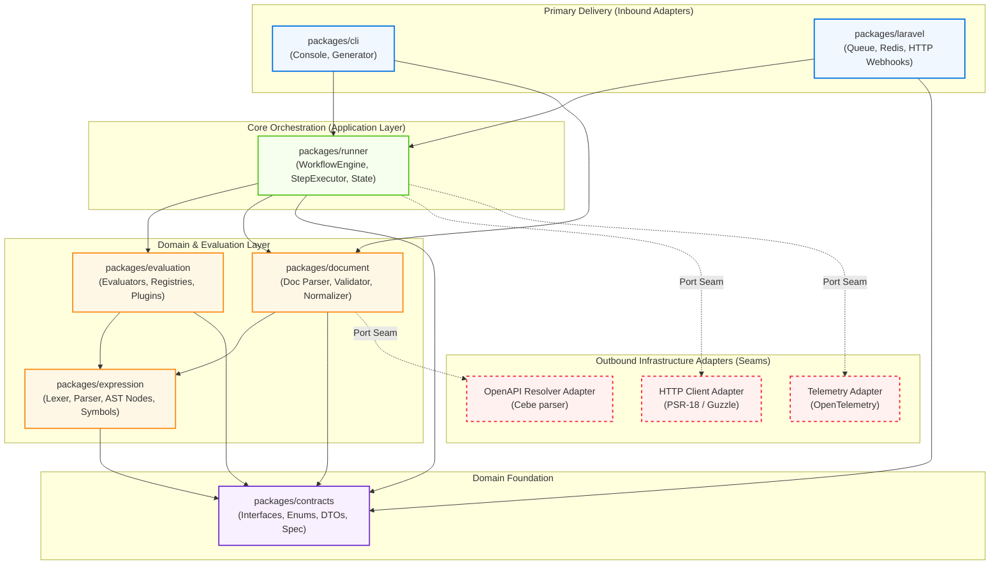
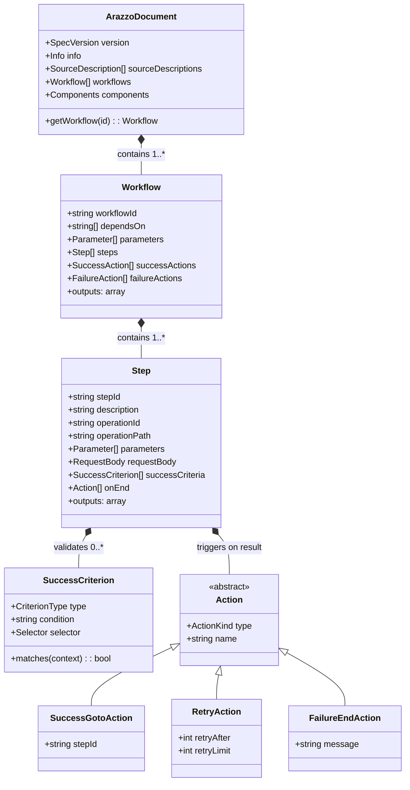
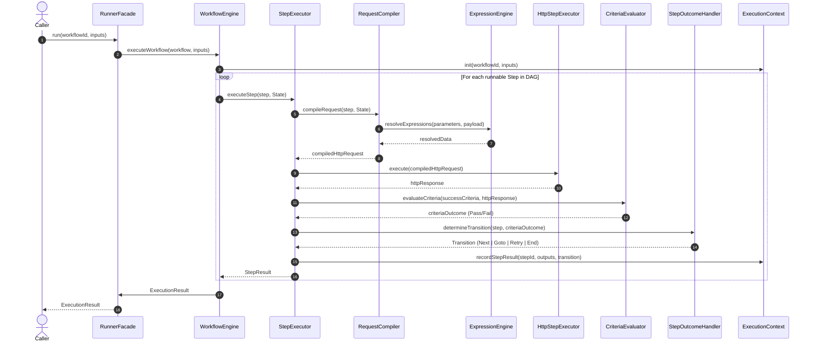
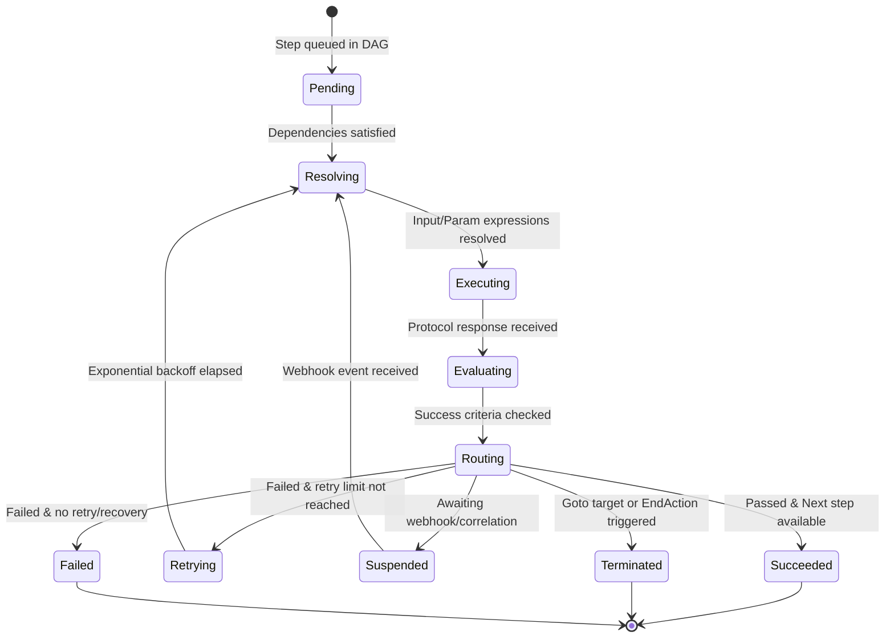
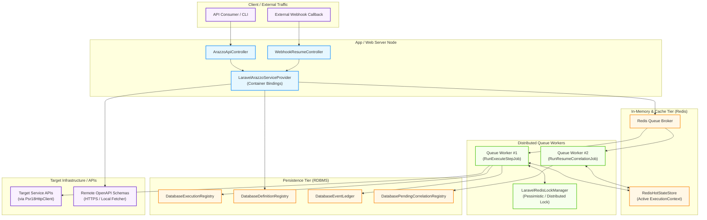

# UML Architectural Specification & Enhancement Design

- **Status**: Approved
- **Author**: Antigravity & Mohammed Alama
- **Date**: 2026-09-23
- **Scope**: End-to-End System Architecture across `php-arazzo` Monorepo (`contracts`, `document`, `expression`, `evaluation`, `runner`, `cli`, `laravel`, `core`)

---

## 1. Executive Summary & Goals

This specification establishes a formal UML architectural model based on the **4+1 Architectural View Model** for `php-arazzo`. The model serves two unified purposes:
1. **Architectural Diagnosis & Enhancement**: Identify and remediate architectural boundary leaks, coupling imbalances, and hidden state mutations.
2. **Deterministic Documentation & Fitness Functions**: Maintain living, machine-verifiable UML models synchronized with source code via automated reflection scripts and enforced by Pest Arch fitness functions.

---

## 2. Document & Artifact Layout

The UML suite is partitioned into **hand-authored architectural models** (`docs/architecture/uml/`) representing design intent and **machine-generated models** (`docs/generated/uml/`) representing the live code state:

```
docs/
├── architecture/
│   └── uml/
│       ├── README.md                       # Navigation hub for the 4+1 UML Views
│       ├── 01-logical-view.md              # Domain Aggregates, AST, & Class Hierarchies
│       ├── 02-development-view.md          # Package Layering, Ports & Adapters, Seams
│       ├── 03-process-view.md              # Execution Sequence & Step State Machine
│       ├── 04-physical-view.md             # Distributed Deployment, Queues, & Redis
│       └── 05-scenarios.md                 # Real-World Execution Scenarios (+1 View)
└── generated/
    └── uml/
        ├── class-diagrams.md               # Auto-extracted Mermaid class diagrams
        └── package-coupling.md             # Automated Ca, Ce, I, A, D metrics table
```

---

## 3. The 4+1 Architectural Views

### 3.1 Development View (Package & Component Architecture)
Describes the physical organization of the monorepo packages, boundary contracts, and port-and-adapter seams.



#### Boundary Remediations Enforced by Development View:
1. **Runner Secondary Ports**: Introduce `Alama\Arazzo\Contracts\Http\HttpClientInterface` and `Alama\Arazzo\Contracts\Source\OpenApiResolverInterface`. Remove direct imports of `GuzzleHttp\*` and `cebe\*` from `packages/runner`.
2. **Telemetry Decoupling**: Invert `OpenTelemetry\*` behind `Alama\Arazzo\Contracts\Telemetry\TracerInterface`.
3. **Symbol Table Contract**: Move symbol table interfaces from `packages/expression` into `packages/contracts` to decouple `packages/document` from expression engine internals.

---

### 3.2 Logical View (Domain Class Models & Registries)
Defines domain aggregates, immutable value objects, AST hierarchies, and evaluator registries.



#### Evaluator Registry Model (`packages/evaluation`):
- `ExpressionEngineInterface`: Single facade for expression resolution.
- `ExpressionEvaluatorRegistry`: Open registry managing `ExpressionEvaluatorPluginInterface` implementations (JSONPath, XPath, regex).
- `CriterionEvaluatorRegistry`: Open registry managing `CriterionEvaluatorPluginInterface` implementations.

---

### 3.3 Process View (Execution Sequence & State Machines)
Captures the runtime lifecycle, step pipelines, and execution state transitions.



#### Step Lifecycle State Machine:


---

### 3.4 Physical & Deployment View (Distributed Runtime Topology)
Models the execution infrastructure in production environments using the Laravel adapter:



---

### 3.5 Scenarios (+1 View)
Traces key real-world Arazzo execution scenarios across the 4 views:
1. **Sequential HTTP Step Execution**: Step A makes request $\rightarrow$ evaluates status code $\rightarrow$ records output $\rightarrow$ Step B uses `$steps.stepA.outputs.id` in path parameter.
2. **Conditional Branching via Actions**: Step returns 404 $\rightarrow$ `FailureGotoAction` directs execution to a recovery step rather than failing workflow.
3. **Asynchronous Webhook Resumption**: Step initiates an async task $\rightarrow$ records `PendingCorrelation` $\rightarrow$ suspends execution $\rightarrow$ inbound webhook hits `WebhookResumeController` $\rightarrow$ resumes state from `RedisHotStateStore`.

---

## 4. Automation & Quality Gates

### 4.1 Automated UML Extraction (`UmlClassDiagramDoc.php`)
- Integrated into `scripts/generate-docs.php` and `scripts/generate-docs/`.
- Scans classes in `packages/*/src`, extracting class names, stereotypes (`<<interface>>`, `<<abstract>>`), inheritance, implemented interfaces, and key public methods.
- Emits deterministic Mermaid `classDiagram` blocks in `docs/generated/uml/class-diagrams.md`.

### 4.2 Architectural Fitness Functions (Pest Arch)
Enforced in `packages/*/tests/ArchTest.php`:
```php
test('contracts package has zero external dependencies')
    ->expect('Alama\Arazzo\Contracts')
    ->toOnlyDependOn([]);

test('runner package does not directly reference third-party transport or schema parsers')
    ->expect('Alama\Arazzo\Runner')
    ->not->toUse(['GuzzleHttp', 'cebe\openapi']);

test('document package only depends on contracts and expression')
    ->expect('Alama\Arazzo\Document')
    ->toOnlyDependOn([
        'Alama\Arazzo\Contracts',
        'Alama\Arazzo\Expression',
    ]);
```

### 4.3 Pre-commit Verification
- Pre-commit hook triggers `composer docs` (running `scripts/generate-docs.php`).
- Output changes in `docs/generated/uml/` are automatically staged, guaranteeing zero documentation drift.
