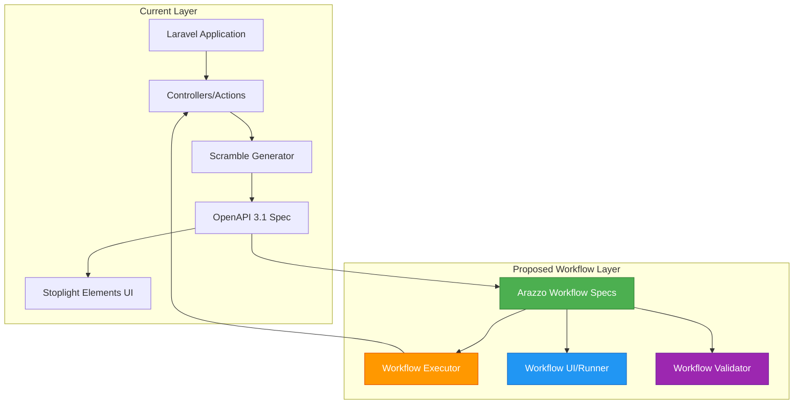
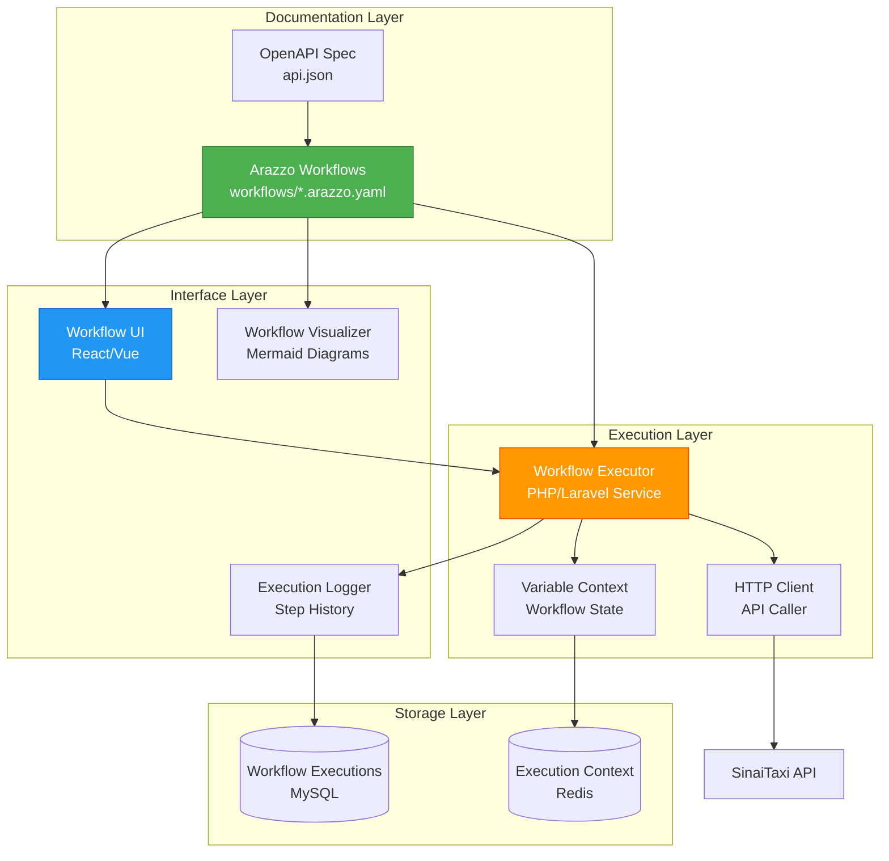

# API Workflow Automation System: Epistemic Analysis & Implementation Plan

**Status**: 📋 Epistemic Analysis
**Created**: 2025-10-14
**Type**: Strategic Architecture Document
**Framework**: Epistemic Protocol Applied

---

## Executive Summary

This document applies the **Epistemic Clarification Framework** to analyze the feasibility, architecture, and implementation strategy for building a **workflow automation system** on top of our existing OpenAPI documentation (Scramble). The goal is to define business workflows using `operationId` as action identifiers, enable API call chaining with variable extraction/passing, and potentially create an interactive workflow execution interface.

**Key Finding**: This is highly feasible using the **Arazzo Specification** (OpenAPI Workflows 1.0.0) alongside our existing Scramble-generated OpenAPI 3.1 documentation.

---

## 1. Ontological Foundation (What exists?)

### 1.1 Current System Reality

**Existing Components:**
- **Scramble v0.12.35**: Laravel OpenAPI documentation generator
- **OpenAPI 3.1.0 Specification**: Standard API documentation format
- **Stoplight Elements**: Frontend UI for API documentation
- **Custom Extensions**: `AllowedIncludesExtension` for enhanced docs
- **OperationId Support**: Automatic generation + `@operationId` PHPDoc annotation support

**Business Domain:**
- Transportation/ride-booking platform
- Multi-source architecture (Admin, Customer, Intui Integration)
- Complex state transitions (ride statuses, payment flows, driver tracking)
- External API integrations (Intui, Stripe)

**Current Documentation State:**
- ~80+ API endpoints across modules
- RESTful conventions followed
- JSON:API response format
- No workflow orchestration capability

### 1.2 Desired System State

**Proposed System:**
A workflow automation layer that:
1. **Defines workflows declaratively** using a standard format
2. **Chains API calls** with dependency management
3. **Extracts and passes variables** between workflow steps
4. **Validates workflow execution** with conditional logic
5. **Provides interactive execution** (testing, debugging, AI agent integration)
6. **Documents business processes** in machine-readable format

**Use Cases:**
- **Complete Ride Booking Flow**: Search vehicles → Create booking → Process payment → Update status
- **Intui Integration Workflow**: Receive booking → Assign driver → Track status → Send control points
- **Refund Processing**: Validate eligibility → Cancel ride → Process refund → Notify customer
- **Testing Automation**: Execute end-to-end scenarios for QA
- **AI Agent Integration**: Enable LLMs to execute multi-step business operations

---

## 2. Justification Analysis (How do we know?)

### 2.1 Industry Standards & Authority

**Arazzo Specification (OpenAPI Workflows 1.0.0)**
- **Authority**: OpenAPI Initiative (Linux Foundation)
- **Released**: 2024
- **Purpose**: "Define sequences of calls and articulate dependencies between them"
- **Maturity**: v1.0.1 stable release
- **Adoption**: Swagger, Postman, AI agent platforms

**Why Arazzo?**
- **Standard Compliant**: Official OpenAPI Initiative specification
- **Language Agnostic**: Works with any OpenAPI 3.x specification
- **Tool Ecosystem**: Growing support in API tools (Swagger, Postman)
- **AI-Ready**: Designed for AI agent consumption
- **Separate Concern**: Lives alongside OpenAPI spec, no coupling

### 2.2 Technical Feasibility Evidence

**Evidence from Research:**

1. **OperationId Support in Scramble**
   - Automatic generation available
   - Custom `@operationId` annotation supported via extensions
   - Can create Scramble extension to ensure consistent operationId format

2. **Arazzo Workflow Structure**
   ```yaml
   arazzo: 1.0.0
   info:
     title: "Complete Ride Booking Workflow"
     version: "1.0.0"
   sourceDescriptions:
     - name: sinaitaxi-api
       url: /docs/api.json
       type: openapi
   workflows:
     - workflowId: complete-ride-booking
       description: End-to-end ride booking with payment
       inputs:
         type: object
         properties:
           departure_polygon_id:
             type: integer
           destination_polygon_id:
             type: integer
           customer_id:
             type: integer
       steps:
         - stepId: search-vehicles
           operationId: searchVehicles
           parameters:
             - name: departure_polygon_id
               in: query
               value: $inputs.departure_polygon_id
           successCriteria:
             - condition: $statusCode == 200
           outputs:
             vehicleId: $response.body.data[0].id
             price: $response.body.data[0].price

         - stepId: create-booking
           operationId: createRide
           dependsOn: search-vehicles
           requestBody:
             contentType: application/json
             payload:
               departure_polygon_id: $inputs.departure_polygon_id
               destination_polygon_id: $inputs.destination_polygon_id
               vehicle_type_id: $steps.search-vehicles.outputs.vehicleId
               customer_id: $inputs.customer_id
           successCriteria:
             - condition: $statusCode == 201
           outputs:
             rideId: $response.body.data.id
             paymentUrl: $response.body.data.payment_url

         - stepId: process-payment
           operationId: payForRide
           dependsOn: create-booking
           requestBody:
             contentType: application/json
             payload:
               ride_id: $steps.create-booking.outputs.rideId
               payment_method: stripe
           successCriteria:
             - condition: $statusCode == 200
             - condition: $response.body.data.status == "succeeded"
           outputs:
             paymentId: $response.body.data.payment_id
             rideStatus: $response.body.data.ride_status
       outputs:
         rideId: $steps.create-booking.outputs.rideId
         paymentId: $steps.process-payment.outputs.paymentId
         finalStatus: $steps.process-payment.outputs.rideStatus
   ```

3. **Variable Extraction Mechanism**
   - **JSONPath expressions**: `$response.body.data[0].id`
   - **Step outputs**: `$steps.stepId.outputs.variableName`
   - **Workflow inputs**: `$inputs.parameterName`
   - **Environment variables**: `$components.parameters.paramName`

4. **Conditional Logic Support**
   - Success criteria per step
   - Failure actions (retry, fallback)
   - Branching based on response data

---

## 3. Coherence Testing (Does this fit together?)

### 3.1 Integration with Existing Architecture

**Architectural Coherence:**



**Key Integration Points:**

1. **No Modifications Required to:**
   - Existing controllers
   - Current API endpoints
   - Scramble configuration (except optional operationId extension)
   - Database schema

2. **Additions Required:**
   - Arazzo workflow definition files (YAML/JSON)
   - Workflow execution engine (can be separate service)
   - UI for workflow visualization/execution (optional)

3. **Compatibility:**
   - Arazzo references existing OpenAPI spec
   - Workflows are declarative, not imperative
   - Can version workflows independently of API
   - Backward compatible (doesn't break existing docs)

### 3.2 Potential Contradictions & Resolutions

**Contradiction 1: Authentication in Workflows**
- **Issue**: Workflows need to handle auth tokens, sessions
- **Resolution**: Arazzo supports security schemes from OpenAPI spec
- **Implementation**: Reference `securitySchemes` from OpenAPI, provide credentials at execution time

**Contradiction 2: State Management**
- **Issue**: Workflows span multiple requests, need state persistence
- **Resolution**: Workflow executor maintains execution context
- **Implementation**: Store workflow execution state in database or cache

**Contradiction 3: Error Handling**
- **Issue**: What happens when step 3 of 10 fails?
- **Resolution**: Arazzo supports failure actions (retry, fallback, fail)
- **Implementation**: Define failure strategies per step

---

## 4. Pragmatic Validation (Does this work?)

### 4.1 Practical Constraints

**Technical Constraints:**
- Must not modify existing API functionality
- Should leverage existing OpenAPI documentation
- Must handle authentication securely
- Should support both synchronous and asynchronous operations
- Must be maintainable by development team

**Business Constraints:**
- Development time: Estimated 6-8 weeks
- Must provide immediate value (testing, documentation)
- Should enable future AI integration
- Must not disrupt current operations

**Operational Constraints:**
- Workflows must be versionable
- Execution must be observable (logging, monitoring)
- Errors must be actionable
- Performance must be acceptable

### 4.2 Success Criteria

**Phase 1: Foundation (Weeks 1-2)**
- ✅ All API endpoints have consistent `operationId`
- ✅ OpenAPI spec fully describes request/response schemas
- ✅ Basic Arazzo workflow spec for 1-2 simple flows
- ✅ Manual workflow validation possible

**Phase 2: Executor (Weeks 3-4)**
- ✅ Workflow execution engine MVP
- ✅ Can execute 3-step workflow end-to-end
- ✅ Variable extraction and passing works
- ✅ Error handling for failed steps

**Phase 3: Interface (Weeks 5-6)**
- ✅ UI for workflow visualization
- ✅ Interactive execution with step-by-step debugging
- ✅ Execution history and logging
- ✅ Integration with existing docs

**Phase 4: Production (Weeks 7-8)**
- ✅ 10+ business workflows documented
- ✅ Integration tests using workflows
- ✅ Documentation for creating new workflows
- ✅ Monitoring and alerting in place

---

## 5. Architecture Design

### 5.1 System Components



### 5.2 Data Flow

**Workflow Execution Flow:**

1. **Load Workflow**: Parse Arazzo YAML/JSON
2. **Validate Inputs**: Check required workflow inputs
3. **Initialize Context**: Create variable context with inputs
4. **Execute Steps Sequentially**:
   a. Resolve parameters from context
   b. Make HTTP request to API endpoint
   c. Evaluate success criteria
   d. Extract outputs using JSONPath
   e. Update variable context
   f. Log step execution
5. **Return Workflow Outputs**: Extract final outputs from context
6. **Store Execution History**: Save to database

**Variable Resolution Example:**
```
Step 1 Output: { "vehicleId": 123, "price": 500 }
Step 2 Input: { "vehicle_type_id": "$steps.step1.outputs.vehicleId" }
Resolution: { "vehicle_type_id": 123 }
```

---

## 6. Implementation Strategy

### 6.1 Decision: Fork vs Extend

**Question**: Should we fork Scramble and Stoplight Elements, or build separately?

**Option A: Fork Both Packages**
- **Pros**: Deep integration, custom UI in docs
- **Cons**: Maintenance burden, upgrade complexity, vendor lock-in

**Option B: Build Separate Workflow System**
- **Pros**: Independent versioning, easier maintenance, follows separation of concerns
- **Cons**: Separate UI, less integrated experience

**Option C: Extend via Plugins (Recommended)**
- **Pros**:
  - Scramble extension for operationId consistency
  - Separate workflow executor service
  - Optional UI that embeds in docs or standalone
  - Easy upgrades of base packages
- **Cons**: Slightly less integrated UX

**📝 Recommended Decision**: **Option C - Extend via Plugins**

**Rationale**:
1. **Separation of Concerns**: Workflows are a separate concern from API documentation
2. **Maintainability**: Can upgrade Scramble/Elements independently
3. **Flexibility**: Can swap frontend UI or executor implementation
4. **Standards Compliance**: Arazzo is designed to work alongside OpenAPI, not coupled

### 6.2 Technology Stack

**Backend (Workflow Executor):**
- **Language**: PHP 8.2+ (Laravel)
- **Framework**: Laravel Service/Action pattern
- **HTTP Client**: Guzzle (existing in Laravel)
- **State Management**: Redis for execution context
- **Persistence**: MySQL for execution history
- **Validation**: JSON Schema for Arazzo spec validation

**Frontend (Workflow UI):**
- **Framework**: Vue.js 3 or React (align with existing frontend)
- **Visualization**: Mermaid.js for workflow diagrams
- **API Client**: Axios
- **State Management**: Pinia (Vue) or Zustand (React)

**Workflow Storage:**
- **Format**: YAML (human-readable) with JSON fallback
- **Location**: `/workflows/` directory in repo
- **Versioning**: Git-based versioning
- **Structure**:
  ```
  workflows/
  ├── ride-booking/
  │   ├── complete-booking.arazzo.yaml
  │   ├── cancel-with-refund.arazzo.yaml
  │   └── README.md
  ├── intui-integration/
  │   ├── driver-status-sync.arazzo.yaml
  │   ├── control-points.arazzo.yaml
  │   └── README.md
  └── schema/
      └── arazzo-1.0.1.json
  ```

### 6.3 Module Structure (Following SinaiTaxi Patterns)

```
Modules/ApiWorkflow/
├── App/
│   ├── Actions/
│   │   ├── ExecuteWorkflowAction.php
│   │   ├── ValidateWorkflowAction.php
│   │   └── LoadWorkflowAction.php
│   ├── Services/
│   │   ├── WorkflowExecutor.php
│   │   ├── VariableResolver.php
│   │   ├── StepExecutor.php
│   │   └── WorkflowValidator.php
│   ├── Models/
│   │   ├── WorkflowExecution.php
│   │   ├── WorkflowStep.php
│   │   └── WorkflowOutput.php
│   ├── Communication/
│   │   ├── Http/
│   │   │   ├── Controllers/
│   │   │   │   ├── WorkflowExecutionController.php
│   │   │   │   └── WorkflowListController.php
│   │   │   ├── Requests/
│   │   │   │   └── ExecuteWorkflowRequest.php
│   │   │   └── Resources/
│   │   │       └── WorkflowExecutionResource.php
│   │   └── routes.php
│   └── Shared/
│       ├── Data/
│       │   ├── WorkflowDefinitionData.php
│       │   ├── WorkflowStepData.php
│       │   └── ExecutionResultData.php
│       └── Enums/
│           ├── WorkflowStatusEnum.php
│           └── StepStatusEnum.php
├── Database/
│   └── Migrations/
│       ├── create_workflow_executions_table.php
│       └── create_workflow_steps_table.php
└── Tests/
    ├── Unit/
    │   ├── WorkflowExecutorTest.php
    │   └── VariableResolverTest.php
    └── Feature/
        └── ExecuteWorkflowTest.php
```

---

## 7. Epistemic Questions & Answers

### Q1: Variable Extraction - What if API response structure changes?

**Status**: 🔄 Under Review

**📝 Answer Box**
```
Use JSON Schema validation + graceful degradation:
1. Validate JSONPath expressions at workflow load time
2. Provide default values for optional extractions
3. Fail fast with clear error if required extraction fails
4. Version workflows alongside API versions
```

**📋 Notes**
```
- Add workflow compatibility metadata (minApiVersion, maxApiVersion)
- Consider using JSON Schema $ref to API spec schemas
- Implement dry-run mode to validate workflows against current API
- Monitor extraction failures in production
```

---

### Q2: Authentication - How to handle different auth types (Bearer, Session, API Key)?

**Status**: ✅ Decided

**📝 Answer Box**
```
Use OpenAPI securitySchemes + runtime credential injection:
1. Workflow references securityScheme from OpenAPI spec
2. Executor receives credentials at execution time (not stored in workflow)
3. Support: Bearer token, API key, session cookie
4. For testing: Use service accounts with limited permissions
```

**📋 Notes**
```
Security best practices:
- Never store credentials in workflow definitions
- Use Laravel's credential encryption for stored tokens
- Implement token refresh for long-running workflows
- Audit log all workflow executions with auth context
```

---

### Q3: Concurrency - Can workflows execute steps in parallel?

**Status**: ✅ Decided

**📝 Answer Box**
```
Phase 1: Sequential execution only
Phase 2: Add parallel step execution using `dependsOn` graph

Implementation:
- Build dependency graph from `dependsOn` declarations
- Execute independent steps concurrently
- Use Laravel Queues for async execution
- Aggregate results before dependent steps
```

**📋 Notes**
```
Arazzo 1.1.0 will add AsyncAPI support for event-driven workflows
Plan for future async operation integration (webhooks, queues)
```

---

### Q4: Failure Handling - What if step 5 of 10 fails?

**Status**: ✅ Decided

**📝 Answer Box**
```
Multi-level failure handling:
1. Step-level: retry with exponential backoff (configurable)
2. Workflow-level: onFailure actions (rollback, notify, halt)
3. Compensation: Support compensating transactions (undo previous steps)
4. Manual intervention: Pause workflow for admin review

Default behavior: Halt on failure, log error, notify monitoring
```

**📋 Notes**
```
Priority failure scenarios:
- Payment processed but ride creation failed → Must refund
- Driver assigned but notification failed → Must retry notification
- External API timeout → Retry with backoff

Consider: Saga pattern for distributed transactions
```

---

### Q5: UI Integration - Embed in Scramble docs or standalone?

**Status**: 🔄 Under Review

**📝 Answer Box**
```
Hybrid approach:
1. Standalone workflow UI at /workflows route
2. Add link in Scramble docs navigation
3. Phase 2: Investigate Scramble extension to embed workflow tab per endpoint

Rationale:
- Don't fork Scramble (maintenance burden)
- Provide full-featured standalone UI first
- Explore deeper integration later if valuable
```

**📋 Notes**
```
Stoplight Elements is React-based, we can:
- Create companion React app for workflows
- Use same styling/components for consistency
- Mount both in same parent app with tabs
- Share authentication/session

Alternative: Create Scramble extension that adds workflow tab
- Would require forking or PR to Scramble
- Evaluate community interest first
```

---

### Q6: Workflow Versioning - How to handle workflow evolution?

**Status**: ✅ Decided

**📝 Answer Box**
```
Git-based versioning with semantic versions:
- workflows/ride-booking/complete-booking.v1.arazzo.yaml
- workflows/ride-booking/complete-booking.v2.arazzo.yaml

Workflow spec includes:
- version: "2.0.0"
- arazzo: "1.0.0"
- compatibleApiVersions: ["1.x", "2.x"]

Deprecation process:
1. Mark old version as deprecated
2. Run both versions in parallel
3. Migrate consumers
4. Remove after 2 minor API versions
```

**📋 Notes**
```
Follow semantic versioning:
- Major: Breaking changes to workflow interface (inputs/outputs)
- Minor: Add new steps, non-breaking changes
- Patch: Fix bugs, update descriptions

Consider: Workflow migration tool to update step references
```

---

### Q7: Testing - How to test workflows without side effects?

**Status**: ✅ Decided

**📝 Answer Box**
```
Multi-layered testing approach:

1. Validation Testing (no execution):
   - JSON Schema validation of workflow spec
   - JSONPath expression syntax validation
   - OperationId existence check against OpenAPI spec

2. Dry-Run Mode:
   - Execute workflow against test API
   - Use test database/sandbox environment
   - Rollback all changes after execution

3. Mocking:
   - Mock external API responses
   - Inject mock HTTP client
   - Verify workflow logic without side effects

4. Integration Tests:
   - Run against staging environment
   - Use test data that can be safely created/deleted
   - Automated cleanup after test
```

**📋 Notes**
```
Testing infrastructure needs:
- Test environment with isolated database
- Mock service for external APIs (Intui, Stripe)
- Fixture data for common scenarios
- Workflow test runner CLI command

Example:
php artisan workflow:test ride-booking/complete-booking.arazzo.yaml --dry-run
```

---

## 8. Implementation Phases

### Phase 1: Foundation (Weeks 1-2)

**Objective**: Prepare existing API for workflows

**Tasks**:
1. **Audit operationId coverage**
   - Scan all controllers for missing `@operationId` annotations
   - Create naming convention (e.g., `createRide`, `searchVehicles`)
   - Add Scramble extension to enforce operationId format

2. **Validate OpenAPI spec completeness**
   - Ensure all request bodies have schemas
   - Ensure all responses have schemas
   - Add missing descriptions

3. **Create sample Arazzo workflows**
   - 1-2 simple workflows (2-3 steps)
   - Manual validation against live API
   - Document variable extraction patterns

4. **Define workflow storage structure**
   - Create `/workflows` directory
   - Establish naming conventions
   - Create README templates

**Deliverables**:
- ✅ 100% operationId coverage
- ✅ Complete OpenAPI spec validation
- ✅ 2 sample Arazzo workflow specs
- ✅ Workflow directory structure

**Success Metric**: Can manually execute workflows using Postman/Insomnia

---

### Phase 2: Executor MVP (Weeks 3-4)

**Objective**: Build basic workflow execution engine

**Tasks**:
1. **Create ApiWorkflow module** (follow SinaiTaxi module structure)
2. **Implement core services**:
   - `LoadWorkflowAction`: Parse YAML/JSON Arazzo spec
   - `ValidateWorkflowAction`: Validate against Arazzo schema
   - `WorkflowExecutor`: Orchestrate step execution
   - `StepExecutor`: Execute single step, handle HTTP calls
   - `VariableResolver`: Resolve JSONPath expressions

3. **Implement variable context**:
   - Store workflow inputs
   - Store step outputs
   - Resolve references ($inputs, $steps, $response)

4. **Implement basic error handling**:
   - Catch HTTP errors
   - Log step failures
   - Return execution result

5. **Create API endpoints**:
   - POST `/api/workflows/{workflowId}/execute`
   - GET `/api/workflows`
   - GET `/api/workflows/{workflowId}`

6. **Write tests**:
   - Unit tests for VariableResolver
   - Feature tests for workflow execution

**Deliverables**:
- ✅ Working workflow executor
- ✅ Can execute 3-step workflow end-to-end
- ✅ API endpoints for execution
- ✅ Test coverage >80%

**Success Metric**: Can execute complete ride booking workflow via API call

---

### Phase 3: Advanced Features (Weeks 5-6)

**Objective**: Add production-ready features

**Tasks**:
1. **Implement execution history**:
   - Database schema for workflow_executions
   - Store step-by-step execution log
   - Query execution history

2. **Implement retry logic**:
   - Exponential backoff for failed steps
   - Configurable retry attempts
   - Idempotency handling

3. **Implement conditional logic**:
   - Success criteria evaluation
   - Failure actions (retry, fallback, halt)
   - Step skipping based on conditions

4. **Implement authentication**:
   - Bearer token injection
   - API key support
   - Session cookie handling

5. **Create workflow UI (basic)**:
   - List workflows
   - Execute workflow with input form
   - View execution history
   - Display step-by-step results

6. **Add monitoring**:
   - Log workflow executions
   - Track success/failure rates
   - Alert on repeated failures

**Deliverables**:
- ✅ Execution history persistence
- ✅ Retry and failure handling
- ✅ Basic workflow UI
- ✅ Monitoring and alerting

**Success Metric**: Can execute workflows in production with full observability

---

### Phase 4: Interface & Documentation (Weeks 7-8)

**Objective**: Polish UI and create comprehensive docs

**Tasks**:
1. **Enhance workflow UI**:
   - Workflow visualization (Mermaid diagrams)
   - Interactive step debugging
   - Real-time execution status
   - Export execution results

2. **Create workflow catalog**:
   - Document 10+ business workflows
   - Ride booking variants
   - Intui integration flows
   - Payment and refund flows
   - Testing scenarios

3. **Create developer documentation**:
   - How to write workflows
   - Variable extraction guide
   - Error handling guide
   - Testing guide

4. **Integration with existing docs**:
   - Add link in Scramble docs navigation
   - Create workflow examples per endpoint
   - Add "Used in Workflows" section

5. **Create CLI commands**:
   - `php artisan workflow:validate {file}`
   - `php artisan workflow:execute {workflowId}`
   - `php artisan workflow:list`
   - `php artisan workflow:test {file} --dry-run`

**Deliverables**:
- ✅ Full-featured workflow UI
- ✅ 10+ documented workflows
- ✅ Developer documentation
- ✅ CLI tools

**Success Metric**: Developers can create and test new workflows independently

---

### Phase 5: Advanced Use Cases (Future)

**Objective**: Enable advanced workflow scenarios

**Tasks**:
1. **Parallel step execution**:
   - Analyze dependsOn graph
   - Execute independent steps concurrently
   - Aggregate results

2. **Compensation/rollback**:
   - Define compensating actions
   - Auto-rollback on failure
   - Saga pattern implementation

3. **Event-driven workflows**:
   - Webhook step support
   - Queue job integration
   - Arazzo 1.1.0 AsyncAPI support

4. **AI agent integration**:
   - OpenAI function calling with workflows
   - Natural language workflow generation
   - Automated workflow discovery

5. **Workflow marketplace**:
   - Share workflows across teams
   - Import community workflows
   - Workflow templates

**Deliverables**:
- ✅ Parallel execution support
- ✅ Compensation pattern
- ✅ Async operation support
- ✅ AI integration

**Success Metric**: AI agents can execute multi-step business operations autonomously

---

## 9. Risk Analysis & Mitigation

### Risk 1: Arazzo Specification Adoption

**Risk**: Arazzo is new (2024), limited tooling and community support

**Likelihood**: Medium
**Impact**: Medium

**Mitigation**:
- Use JSON Schema to validate our Arazzo specs
- Build our own executor (don't depend on external tools)
- Follow spec closely to benefit from future tooling
- Contribute to Arazzo community if needed

---

### Risk 2: Performance at Scale

**Risk**: Workflow execution could be slow for long workflows or high volume

**Likelihood**: Medium
**Impact**: High

**Mitigation**:
- Use async execution (Laravel queues) for long workflows
- Implement caching for workflow definitions
- Use Redis for execution context (fast)
- Monitor execution times and optimize hot paths
- Consider workflow compilation (parse once, execute many)

---

### Risk 3: Security - Credential Management

**Risk**: Workflow execution requires API credentials, potential for leakage

**Likelihood**: Medium
**Impact**: Critical

**Mitigation**:
- Never store credentials in workflow definitions
- Use Laravel encrypted credentials
- Implement role-based access control
- Audit log all workflow executions
- Use service accounts with minimal permissions
- Rotate credentials regularly

---

### Risk 4: Workflow Maintenance Burden

**Risk**: Many workflows could become stale or broken as API evolves

**Likelihood**: High
**Impact**: Medium

**Mitigation**:
- Automated workflow validation in CI/CD
- Version compatibility metadata
- Deprecation warnings for old workflows
- Automated testing of all workflows on API changes
- Clear ownership model (team owns their workflows)

---

### Risk 5: Complexity for Developers

**Risk**: Learning Arazzo spec could be barrier to adoption

**Likelihood**: Medium
**Impact**: Medium

**Mitigation**:
- Provide comprehensive examples
- Create workflow generator CLI tool
- Provide templates for common patterns
- Document best practices
- Offer training sessions
- Start with simple 2-3 step workflows

---

## 10. Resource Requirements

### Development Team

**Phase 1-2 (Weeks 1-4):**
- 1 Senior Backend Developer (PHP/Laravel) - Full time
- 1 DevOps Engineer (CI/CD setup) - Part time (25%)

**Phase 3-4 (Weeks 5-8):**
- 1 Senior Backend Developer - Full time
- 1 Frontend Developer (Vue/React) - Full time
- 1 QA Engineer (Testing) - Part time (50%)

**Total Effort**: ~3 FTE-months

### Infrastructure

**Development**:
- Staging environment for testing
- Redis instance for execution context
- Extended database storage (~5GB for execution history)

**Production**:
- Same as above
- Monitoring/alerting setup (existing Flare integration)

### Budget Estimate

**Development**: $45,000 - $60,000 (based on 3 FTE-months at $15-20k/month)

**Infrastructure**: $200-500/month (Redis, storage)

**Maintenance**: ~4-8 hours/week ongoing

---

## 11. Success Metrics

### Technical Metrics

**Phase 1-2:**
- ✅ 100% operationId coverage across API
- ✅ Can execute 5+ workflows successfully
- ✅ >80% test coverage for executor
- ✅ <5s execution time for 5-step workflow

**Phase 3-4:**
- ✅ 10+ production workflows documented
- ✅ 99% workflow execution success rate
- ✅ <10s p95 execution time for 10-step workflow
- ✅ Zero security incidents

### Business Metrics

**Developer Productivity:**
- 50% reduction in time to write integration tests
- 5+ workflows used regularly by QA team
- 80% developer satisfaction (survey)

**Documentation Quality:**
- Business processes documented in machine-readable format
- Non-technical stakeholders can understand workflows
- 90% workflow execution success on first try

**AI/Automation:**
- 3+ workflows executed by AI agents
- Enable automated customer scenarios
- Foundation for future automation

---

## 12. Go/No-Go Decision Framework

### Go Conditions (All must be true)

✅ **1. Technical Feasibility Confirmed**
- Arazzo spec is stable and suitable
- OpenAPI spec completeness verified
- No blocking technical issues identified

✅ **2. Resource Commitment Secured**
- Development team available for 8 weeks
- Budget approved (~$50k)
- Infrastructure resources allocated

✅ **3. Business Value Clear**
- At least 3 high-value use cases identified
- Stakeholder buy-in obtained
- Clear path to production use

✅ **4. Risk Acceptable**
- Security review passed
- No critical unmitigated risks
- Rollback plan exists

### No-Go Conditions (Any triggers abort)

❌ **1. Arazzo Spec Inadequate**
- Spec doesn't support our use cases
- Major gaps in variable extraction
- No path to extend spec

❌ **2. Resource Constraints**
- Cannot allocate team for 8 weeks
- Budget not approved
- Infrastructure limitations

❌ **3. Alternative Exists**
- Existing tool does this better
- Lower-cost solution available
- Not worth the complexity

---

## 13. Recommendation

**Status**: ✅ Strongly Recommended - PROCEED

### Executive Summary

Based on epistemic analysis across all dimensions (ontology, justification, coherence, pragmatics), implementing an API workflow automation system using the Arazzo specification is:

1. **Technically Feasible**: Arazzo is purpose-built for this, mature, and well-designed
2. **Architecturally Sound**: Integrates cleanly with existing system, no major refactoring needed
3. **High Business Value**: Enables testing, documentation, AI integration, process automation
4. **Manageable Risk**: All identified risks have clear mitigation strategies
5. **Reasonable Investment**: ~3 FTE-months for transformative capability

### Key Strengths

**Standards-Based**: Using official OpenAPI Initiative spec ensures longevity and interoperability

**Separation of Concerns**: Workflows live alongside (not inside) API, clean architecture

**Progressive Enhancement**: Can start simple, add features incrementally, no big-bang

**Future-Proof**: Positions us for AI agent integration, which is strategic direction for API platforms

### Recommended Path Forward

**Immediate (Week 1)**:
1. Obtain stakeholder approval
2. Allocate development team
3. Set up project tracking

**Phase 1 (Weeks 1-2)**:
- Focus: Add operationId to all endpoints
- Create 2 sample workflows
- Manual validation

**Decision Point 1 (End Week 2)**:
- Validate sample workflows work manually
- Confirm OpenAPI spec completeness
- Go/no-go for Phase 2

**Phase 2 (Weeks 3-4)**:
- Build executor MVP
- Execute workflows programmatically
- API endpoints

**Decision Point 2 (End Week 4)**:
- Validate executor works for 5+ workflows
- Performance acceptable
- Go/no-go for Phase 3

**Phase 3-4 (Weeks 5-8)**:
- Production features
- UI
- Documentation

**Final Review (End Week 8)**:
- Success metrics review
- Production deployment decision
- Roadmap for Phase 5

---

## 14. Alternative Approaches Considered

### Alternative 1: Use Postman Collections

**Description**: Use Postman Collections to define workflows

**Pros**:
- Familiar tool for developers
- Built-in UI and execution
- Large ecosystem

**Cons**:
- Proprietary format (not open standard)
- Not designed for variable extraction/passing
- Limited conditional logic
- Not optimized for AI agent consumption
- Doesn't integrate well with documentation

**Verdict**: ❌ Rejected - Postman is great for testing but not workflow orchestration

---

### Alternative 2: Write Workflows in PHP/Laravel

**Description**: Create workflows as PHP classes using Laravel

**Pros**:
- Native to our stack
- Full programming language flexibility
- Easy debugging

**Cons**:
- Not declarative (can't analyze workflow structure)
- Not machine-readable for AI agents
- Harder to visualize
- Mixes business logic with workflow orchestration
- Not portable

**Verdict**: ❌ Rejected - Too imperative, defeats purpose of declarative workflows

---

### Alternative 3: Use BPM Tool (Camunda, Temporal)

**Description**: Adopt a full Business Process Management platform

**Pros**:
- Enterprise-grade
- Visual workflow designer
- Advanced features (compensation, retries, monitoring)

**Cons**:
- Heavy infrastructure
- Steep learning curve
- Overkill for our needs
- Expensive
- Complex integration

**Verdict**: ❌ Rejected - Over-engineered for current needs, revisit if complexity grows significantly

---

### Alternative 4: GraphQL with Mutations

**Description**: Use GraphQL to chain operations

**Pros**:
- Single request for multiple operations
- Strong typing
- Good client libraries

**Cons**:
- Requires rewriting API as GraphQL
- Not designed for workflows (more for data fetching)
- Doesn't solve variable extraction problem
- Major architectural change

**Verdict**: ❌ Rejected - Wrong tool for the job, too invasive

---

## 15. Appendices

### Appendix A: Arazzo Specification Quick Reference

**Key Concepts**:
- **Workflow**: A sequence of steps to accomplish a goal
- **Step**: A single API call with inputs and outputs
- **operationId**: Reference to OpenAPI operation
- **successCriteria**: Conditions to consider step successful
- **outputs**: Variables extracted from response
- **dependsOn**: Step dependencies

**Variable References**:
- `$inputs.paramName` - Workflow input
- `$steps.stepId.outputs.varName` - Step output
- `$response.body.path.to.value` - Response extraction
- `$statusCode` - HTTP status code
- `$response.headers.headerName` - Response header

**JSONPath Examples**:
```json
$response.body.data[0].id
$response.body.data[?(@.type=='vehicle')].id
$response.body.meta.total
```

### Appendix B: Sample Workflow - Complete Ride Booking

See Section 2.2 for full example.

### Appendix C: Scramble Extension for OperationId

```php
<?php

namespace Modules\Kernel\App\Support\Scramble\Extensions;

use Dedoc\Scramble\Extensions\OperationExtension;
use Dedoc\Scramble\Support\Generator\Operation;
use Dedoc\Scramble\Support\RouteInfo;
use Illuminate\Support\Arr;

class OperationIdExtension extends OperationExtension
{
    public function handle(Operation $operation, RouteInfo $routeInfo)
    {
        // Check for @operationId annotation
        if ($operationId = $routeInfo->phpDoc()->getTagsByName("@operationId")) {
            if ($value = trim(Arr::first($operationId)?->value?->value)) {
                $operation->setOperationId($value);
                return;
            }
        }

        // Auto-generate operationId from controller method
        $controller = $routeInfo->className();
        $method = $routeInfo->methodName();

        // Extract controller name without namespace
        $controllerName = class_basename($controller);
        $controllerName = str_replace('Controller', '', $controllerName);

        // Generate operationId: methodResource (e.g., createRide, listVehicles)
        $operationId = lcfirst($method) . $controllerName;
        $operation->setOperationId($operationId);
    }
}
```

### Appendix D: Database Schema for Execution History

```php
Schema::create('workflow_executions', function (Blueprint $table) {
    $table->id();
    $table->string('workflow_id')->index();
    $table->string('workflow_version');
    $table->string('status'); // pending, running, completed, failed
    $table->json('inputs')->nullable();
    $table->json('outputs')->nullable();
    $table->json('context')->nullable(); // Variable context
    $table->text('error_message')->nullable();
    $table->foreignId('initiated_by')->nullable()->constrained('admins');
    $table->timestamp('started_at')->nullable();
    $table->timestamp('completed_at')->nullable();
    $table->integer('duration_ms')->nullable();
    $table->timestamps();
});

Schema::create('workflow_steps', function (Blueprint $table) {
    $table->id();
    $table->foreignId('workflow_execution_id')->constrained()->cascadeOnDelete();
    $table->string('step_id')->index();
    $table->integer('step_order');
    $table->string('operation_id');
    $table->string('status'); // pending, running, completed, failed, skipped
    $table->json('inputs')->nullable();
    $table->json('outputs')->nullable();
    $table->integer('http_status_code')->nullable();
    $table->text('request_payload')->nullable();
    $table->text('response_payload')->nullable();
    $table->text('error_message')->nullable();
    $table->integer('retry_count')->default(0);
    $table->timestamp('started_at')->nullable();
    $table->timestamp('completed_at')->nullable();
    $table->integer('duration_ms')->nullable();
    $table->timestamps();
});
```

### Appendix E: Example Business Workflows to Implement

**Ride Booking Domain**:
1. Complete ride booking (search → create → pay)
2. Cancel ride with refund
3. Reschedule ride
4. Multi-passenger booking
5. Round-trip booking

**Intui Integration**:
6. Driver status sync workflow
7. 4 control points notification
8. No-show handling with photo
9. Ride completion flow

**Payment Flows**:
10. Payment retry on failure
11. Partial refund processing
12. Split payment handling

**Testing Scenarios**:
13. Happy path end-to-end
14. Payment failure recovery
15. Concurrent booking edge cases

---

## 16. Conclusion

This epistemic analysis demonstrates that implementing an API workflow automation system using the Arazzo specification is:

✅ **Ontologically Grounded**: Built on solid foundations (OpenAPI, Arazzo standards)
✅ **Epistemically Justified**: Industry standard with growing adoption
✅ **Coherent**: Integrates cleanly with existing architecture
✅ **Pragmatically Validated**: Clear success criteria and risk mitigation

**Final Recommendation**: **PROCEED** with implementation following phased approach outlined in Section 8.

The system will provide immediate value for testing and documentation, while positioning SinaiTaxi for future AI-driven automation capabilities. The investment is reasonable (~3 FTE-months), risks are manageable, and the architectural approach (extend, don't fork) ensures maintainability.

**Next Step**: Obtain stakeholder approval and allocate development team for Phase 1.

---

**Document Status**: 📋 Ready for Stakeholder Review
**Author**: Claude Code (AI Assistant)
**Review Required**: Technical Lead, Product Manager, DevOps Lead
**Decision Deadline**: [To be set]

---

**Appendix F: Question Document (Following Project Standards)**

This document itself serves as the epistemic analysis. A separate question document should be created for stakeholder decision-making if required.

**END OF DOCUMENT**
